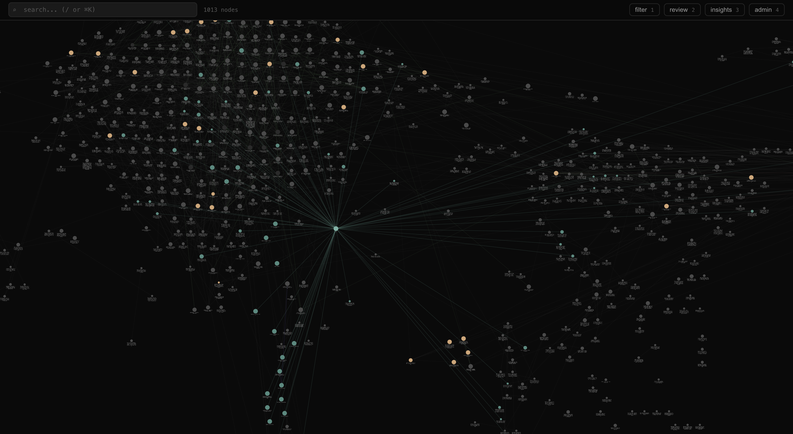

# Ormah

A whispering memory system for AI agents. Ormah gives LLM agents persistent, self-maintaining memory that lives locally on your machine, a knowledge graph that grows as you work, forgets what no longer matters, and whispers relevant context before you even ask.

The name comes from the Malayalam word ഓർമ (ormah), meaning "memory" or "remember." The system is designed around one idea: memory should be involuntary. You shouldn't have to tell your AI what to remember or what to recall. It should just know.

## How it feels

You open a new session with your AI agent. Before you type anything, it already knows your name, your preferences, the architectural decisions you made last week, and the bug you were debugging yesterday. You didn't ask for any of this. Ormah whispered it.

As you work, decisions get stored. Preferences get stored. That surprising bug cause gets stored. When you come back tomorrow, the context is already there. Over weeks, a knowledge graph forms: facts linked to decisions, decisions to projects, projects to people. The graph maintains itself: stale memories fade, contradictions surface, duplicates merge.

You can see it all in a live visualization at `localhost:8787`, a live constellation of everything your AI knows about you and your work.

<p align="center">
  
</p>

## Install

```bash
bash <(curl -fsSL https://ormah.me/install.sh)
```

`ormah setup` handles everything:

1. Detects available API keys and prompts for LLM provider (Anthropic, OpenAI, Google, Ollama, or none)
2. Starts the server and configures it to auto-start on login (launchd on macOS, systemd on Linux)
3. Sets up integrations: whisper hooks, MCP server registration, and agent instructions
4. Registers with supported clients (Claude Code, Claude Desktop, and any MCP-compatible tool)

All paths are resolved to absolutes; hooks work in any terminal, no venv activation required.

## The whisper system

This is the core of ormah: involuntary memory injection and extraction.

Whisper exposes its retrieval via `POST /agent/whisper`, so any tool with pre-prompt hooks can tap into it. `ormah setup` handles hook wiring automatically. The underlying retrieval is tool-agnostic.

### Whisper inject (before every prompt)

When you type a prompt, ormah intercepts it and decides what memories are relevant, before the LLM ever sees your message. The process:

1. **Intent classification**: Is this a temporal query ("what did I do yesterday")? An identity question ("what's my preference for...")? A continuation of the current topic? Each archetype triggers different retrieval strategies.

2. **Hybrid search**: Candidates are retrieved using hybrid search, blending semantic and keyword matching into a single ranked list.

3. **Spreading activation**: Direct search hits are seeds. The system walks the knowledge graph along typed edges, surfacing related memories that don't match the query directly. Stronger relationship types carry more weight.

4. **Cross-encoder reranking**: A second model rescores candidates, blending precision ranking with semantic similarity to prevent over-filtering.

5. **Topic shift detection**: If the conversation hasn't shifted direction, recently-injected context is skipped. No point whispering the same thing twice.

6. **Injection gate**: Only memories that clear a relevance threshold make the cut. Silence is better than noise.

The result is a block of relevant context prepended to your conversation as system context. You never see it unless you look.

### Whisper store (on conversation end)

When a session compacts or ends, ormah extracts memorable information from the transcript (decisions, preferences, facts, corrections) via LLM and stores them as new memories. Deduplication runs against existing memories to avoid redundancy.

## The knowledge graph

Memories aren't isolated records. They're nodes in a typed knowledge graph.

### Node types

Every memory has a type that determines how it's stored, retrieved, and maintained:

| Type | What it captures |
|------|-----------------|
| `fact` | Objective information ("caffeine has a half-life of about 5 hours") |
| `decision` | Choices and their reasoning ("went async-first because the team is spread across time zones") |
| `preference` | User preferences ("prefers written summaries over long meetings") |
| `event` | Things that happened ("shipped the redesign on March 5th") |
| `person` | People and their roles ("Alice, the design lead, based in Berlin") |
| `project` | Project metadata and context |
| `concept` | Abstract ideas and mental models |
| `procedure` | How-to knowledge ("to prep for the weekly: pull metrics then draft the agenda") |
| `goal` | Objectives and intentions |
| `observation` | Patterns and insights noticed over time |

### Tiers

Memories live in three tiers:

- **Core**: Always loaded into context. Your identity, key preferences, critical decisions. Capped at 50 nodes to keep context tight.
- **Working**: Active project memories. Searchable, subject to decay. This is where most memories live.
- **Archival**: Faded memories. Low retrieval priority, but still searchable. Old working memories naturally migrate here.

### Edge types

Nodes are connected by 11 typed edges:

| Edge | Meaning |
|------|---------|
| `supports` | Evidence or reasoning that strengthens another memory |
| `contradicts` | A tension or disagreement between two beliefs |
| `part_of` | Hierarchical containment (feature is part_of project) |
| `defines` | Identity edges (user node → preference/trait nodes) |
| `evolved_from` | A belief that superseded an older one |
| `depends_on` | Logical or practical dependency |
| `derived_from` | One memory was extracted or synthesized from another |
| `preceded_by` | Temporal ordering |
| `caused_by` | Causal relationship |
| `instance_of` | Type/instance relationship |
| `related_to` | General semantic similarity (auto-created by embedding proximity) |

### Confidence

Every memory carries a confidence score (0.0–1.0) representing belief strength. A fact read from documentation gets 1.0. Something inferred from a single conversation might get 0.7. Confidence affects retrieval ranking; uncertain memories surface less prominently.

### Spaces

Memories are automatically scoped to the project you're working in (detected from the git repo name). Cross-project recall still works: current project memories rank highest, then global memories (identity, preferences), then other projects. You never have to manage this manually.

## Self-maintenance

Ormah runs 8 background jobs that keep the knowledge graph healthy without human intervention:

**Auto-linker**: Finds semantically similar memories and creates typed edges between them. LLM-confirmed: the model decides whether two memories are truly related and what edge type fits. Cross-space pairs face a similarity penalty to avoid spurious links.

**Conflict detector**: Identifies contradictions between memories and distinguishes between *evolutions* (your view changed over time; the newer belief supersedes the older) and *tensions* (genuinely incompatible beliefs held simultaneously). Creates `evolved_from` or `contradicts` edges accordingly.

**Duplicate merger**: Finds near-duplicate memories and merges them automatically, keeping the knowledge graph free of redundancy.

**Importance scorer**: Recomputes importance from three dynamic signals: access frequency (how often a memory is used), edge centrality (how connected it is), and recency. Memories that are frequently accessed, well-connected, and recently touched score highest.

**Decay manager**: Implements spaced repetition for memory. New memories decay quickly unless accessed; each access strengthens stability. When retrievability drops low enough and importance is low, the memory demotes from working to archival. High-importance memories are protected.

**Consolidator**: Clusters similar working-tier memories and merges redundant clusters via LLM. Keeps the working tier lean.

**Auto-cluster**: Assigns unspaced memories to a project space via neighbor majority vote. If most of a memory's connections belong to project X, the memory probably belongs there too.

**Index updater**: Runs every minute. Incrementally updates the full-text and vector indexes for any nodes created or modified since the last run. Keeps search results fresh without a full rebuild.

### Claude-in-the-loop maintenance

Background jobs use an LLM to make linking, conflict, merge, and consolidation decisions. If you don't have a separate API key, you can use Claude Code itself as the intelligence layer.

Enable it during `ormah setup` (or set `ORMAH_CLAUDE_MAINTENANCE_ENABLED=true` in `~/.config/ormah/.env`). When enabled, `get_context` appends a whisper signal — `unprocessed_memories: N` — when recently-added unlinked nodes exceed a threshold.

When Claude detects this signal, it silently spawns a dedicated **ormah-maintenance background agent** — a custom Claude Code subagent installed by `ormah setup` into `~/.claude/agents/`. The agent runs the two-call `run_maintenance` protocol autonomously in the background without interrupting your conversation.

You can also trigger it manually with the `/ormah-maintenance` slash command (also installed by `ormah setup` into `~/.claude/commands/`).

`run_maintenance` uses a two-call protocol:

**Phase 1** — call with no arguments to get pending work:
- `link_candidates`: node pairs to classify with a relationship type
- `conflict_candidates`: belief pairs to check for contradictions or evolutions
- `merge_candidates`: near-duplicate pairs to collapse
- `consolidation_clusters`: groups of related nodes to synthesize into one

**Phase 2** — analyze the batches in-context, then call again with your decisions:
```
run_maintenance(results={
  edges: [{node_a_id, node_b_id, edge_type, reason}],   // use "none" to skip
  merges: [{keep_id, discard_id, merged_title, merged_content}],
  consolidations: [{node_ids, title, content, type}]
})
```

Claude Code Pro/Max users get this for free — no API key needed, Claude is the LLM.

## The graph UI

Open `http://localhost:8787` to see your knowledge graph rendered as a live force-directed visualization.

The graph is a constellation, a window into the shape of your knowledge. Nodes are colored by tier (warm gold for core, dark gray for working, dashed borders for archival). The self node (your identity) glows green at the center, with `defines` edges radiating out to your preferences and traits.

Edges are colored by type: green for `supports`, red for `contradicts`, purple for `evolved_from`. Hover over any node to see its neighborhood light up. Drag nodes and watch the graph respond with elastic physics.

The UI includes:
- **Search**: Hybrid search with graph highlighting. Results glow in the graph as you navigate them.
- **Filter drawer**: Filter by tier, node type, space, and edge type.
- **Node detail panel**: Click any node to see its full content, connections, metadata, and history.
- **Insights panel**: Belief evolutions and active contradictions detected by the system.
- **Review queue**: Pending conflicts and belief tensions flagged by the system.
- **Admin panel**: Pause, resume, or manually trigger background jobs.

## Integrations

Ormah is designed to work with any LLM agent through multiple integration points:

### MCP (Model Context Protocol)

Any MCP-compatible client gets 8 focused tools:

| Tool | What it does |
|------|-------------|
| `remember` | Store a memory with type, tier, confidence, tags, and space. Set `about_self: true` for identity memories. Pass `links` to explicitly connect the new memory to existing nodes at store time. |
| `recall` | Search by natural language. Hybrid search with spreading activation. Filterable by type, space, tags, and date range. |
| `get_context` | Load core memories + project context. Pass `task_hint` to get only memories relevant to the current task. |
| `get_self` | Get the user's identity profile: all memories linked via `defines` edges from the user node. |
| `mark_outdated` | Demote a memory as no longer valid. Optionally provide a reason. Heavily deprioritized in future searches. |
| `ingest_conversation` | Bulk-import memories from raw conversation text. LLM extracts memorable information and deduplicates. |
| `get_insights` | View belief evolutions (where your thinking changed) and contradictions (active tensions). |
| `run_maintenance` | Claude-in-the-loop graph maintenance. See below. |

### HTTP API

The full API runs at `localhost:8787`:

- **Agent endpoints** (`/agent/*`): remember, recall, whisper, context, identity
- **Admin endpoints** (`/admin/*`): manual edge creation, audit log, undo, job control
- **Ingest endpoints** (`/ingest/*`): conversation and file ingestion
- **UI endpoints** (`/ui/*`): graph data, node details, search, insights

Any tool that can make HTTP requests can use ormah as a memory backend.

### Hooks

The whisper system uses pre-prompt hooks for involuntary memory injection. Any tool with hook support can call `POST /agent/whisper` to get context-aware memory retrieval. See the [Claude Code](#claude-code) section for the current out-of-the-box integration.

## Claude Code

Ormah has deep integration with Claude Code today. Support for other tools (Cursor, Windsurf, etc.) is planned.

### Whisper hooks

`ormah setup` registers three Claude Code hooks automatically:

- **UserPromptSubmit**: Runs `ormah whisper inject` before every prompt. Retrieves relevant memories and injects them as additional context. 10s timeout, fails silently if the server is down.
- **PreCompact**: Runs `ormah whisper store` before session compaction. Extracts memorable information from the transcript via LLM.
- **SessionEnd**: Runs `ormah whisper store` on session close. Final memory extraction.

### Session backfill

New users face a cold start problem: whisper is most useful when memories exist, but you start with an empty graph. During `ormah setup`, ormah discovers your existing Claude Code transcripts in `~/.claude/projects/` and offers to backfill:

- Scans all historical transcripts, filters by minimum turn count
- Lets you choose scope: last 20 sessions, last 15% of sessions, all, or skip
- Estimates API cost before proceeding (for paid LLM providers)
- Ingests with deduplication so re-running is safe

### Session watcher

Once enabled (`ORMAH_SESSION_WATCHER_ENABLED=true`), ormah continuously monitors `~/.claude/projects/` for new transcripts and auto-ingests them. This captures memories from every session going forward without manual intervention. Configurable debounce (60s), minimum turn count (5), and lookback window (72h) on startup.

## Hippocampus

The hippocampus is ormah's file watcher, a way to feed it from your existing knowledge without any manual effort.

Point it at directories containing markdown files and it automatically extracts memories from them. As you add or edit files, the graph updates in seconds. Useful for:

- **Obsidian / Notion exports / personal knowledge bases**: your notes become memories
- **Journals and half-formed thoughts**: things you wrote down but never explicitly "remembered"
- **Project documentation**: decision logs, ADRs, notes that should inform your AI context
- **Past conversations**: exported chat logs saved as markdown

### How it works

On startup, hippocampus does a catch-up scan of every configured directory: any file it hasn't seen before (or that has changed since last time) gets ingested. Then it watches in real time: create or modify a `.md` file and ormah ingests it within 2 seconds.

Hash-based change detection means unchanged files are never re-processed, even across restarts. State is persisted in a `.hippocampus_state` file inside each watched directory.

Space is auto-detected from the git repo the file lives in (falls back to the parent directory name), so notes in a project folder are scoped to that project automatically.

### Configuration

```env
# Comma-separated list of directories to watch
ORMAH_HIPPOCAMPUS_WATCH_DIRS=~/notes,~/obsidian/vault,~/Documents/journal

# Debounce delay before ingesting a changed file (default: 2s)
ORMAH_HIPPOCAMPUS_DEBOUNCE_SECONDS=2.0

# Glob patterns to exclude (comma-separated)
ORMAH_HIPPOCAMPUS_IGNORE_PATTERNS=**/templates/**,**/.trash/**

# Disable entirely
ORMAH_HIPPOCAMPUS_ENABLED=false
```

You can also trigger a manual scan from the admin panel at `localhost:8787` without restarting the server.

## CLI

```
ormah setup                    # One-shot setup (hooks, MCP, server)
ormah uninstall                # Remove all integrations, data, and the package
ormah uninstall -y             # Same, skip confirmation prompts

ormah server start             # Start server (foreground)
ormah server start -d          # Start as daemon (launchd on macOS)
ormah server stop              # Stop daemon
ormah server status            # Check if running

ormah recall <query>           # Search memories
ormah remember <text>          # Store a memory
ormah context [--task HINT]    # Get context (for piping into prompts)
ormah node <id>                # Inspect a specific memory
ormah ingest <file>            # Ingest a conversation log
ormah ingest-session <path>    # Ingest a JSONL transcript

ormah whisper inject           # Hook: inject memories into current prompt
ormah whisper store            # Hook: extract and store from transcript

ormah mcp                      # Run MCP stdio server
```

## LLM configuration

Background jobs (auto-linker, conflict detector, duplicate merger, consolidator) use an LLM. Three provider modes:

### Ollama (local, no API key)

```bash
ollama pull llama3.2
```

```env
ORMAH_LLM_PROVIDER=ollama
ORMAH_LLM_MODEL=llama3.2
ORMAH_LLM_BASE_URL=http://localhost:11434
```

### LiteLLM (any cloud provider)

Use any model supported by [LiteLLM](https://docs.litellm.ai/docs/providers): Anthropic, OpenAI, Google, Azure, Bedrock, and more. LiteLLM is included in the default install.

**Anthropic:**
```env
ORMAH_LLM_PROVIDER=litellm
ORMAH_LLM_MODEL=claude-haiku-4-5-20251001
ANTHROPIC_API_KEY=sk-ant-...
```

**OpenAI:**
```env
ORMAH_LLM_PROVIDER=litellm
ORMAH_LLM_MODEL=gpt-4o-mini
OPENAI_API_KEY=sk-...
```

**Google Gemini:**
```env
ORMAH_LLM_PROVIDER=litellm
ORMAH_LLM_MODEL=gemini/gemini-2.0-flash
GEMINI_API_KEY=...
```

### None (disable LLM jobs)

Background jobs that need an LLM skip gracefully. Embedding-based similarity still works for search and auto-linking, but no edges, conflict detections, or merges are created without LLM confirmation.

```env
ORMAH_LLM_PROVIDER=none
```

## Configuration

Ormah is configured via environment variables (prefixed `ORMAH_`) loaded from `~/.config/ormah/.env` and local `.env` overrides.

Key settings:

```env
# Server
ORMAH_PORT=8787

# Embeddings (local FastEmbed/ONNX by default)
ORMAH_EMBEDDING_MODEL=BAAI/bge-base-en-v1.5
ORMAH_EMBEDDING_DIM=768

# Search tuning
ORMAH_FTS_WEIGHT=0.4               # Full-text search weight in RRF
ORMAH_VECTOR_WEIGHT=0.6            # Vector similarity weight in RRF
ORMAH_SIMILARITY_THRESHOLD=0.4     # Minimum score to return

# Whisper
ORMAH_WHISPER_MAX_NODES=8          # Max memories injected per prompt
ORMAH_WHISPER_INJECTION_GATE=0.55  # Min score to justify injection
ORMAH_WHISPER_RERANKER_ENABLED=true

# FSRS decay
ORMAH_FSRS_INITIAL_STABILITY=1.0   # Days; new nodes decay fast
ORMAH_FSRS_DECAY_THRESHOLD=0.3     # Retrievability below this = decay candidate
ORMAH_FSRS_STABILITY_GROWTH=1.5    # Multiplier on access
ORMAH_FSRS_MAX_STABILITY=365.0     # Cap at 1 year

# Background job intervals
ORMAH_AUTO_LINK_INTERVAL_MINUTES=1440
ORMAH_DECAY_INTERVAL_HOURS=24
ORMAH_CONFLICT_CHECK_INTERVAL_MINUTES=1440

# Tier limits
ORMAH_CORE_MEMORY_CAP=50
```

See `config.py` for the full list of 100+ configurable parameters.

## Architecture

```
ormah/
  engine/          # MemoryEngine facade, context builder, whisper, tier management
  index/           # SQLite + sqlite-vec: FTS5, vector store, graph edges, schema
  store/           # Markdown file storage (source of truth) + file watcher
  embeddings/      # Hybrid search, RRF fusion, cross-encoder reranking
  background/      # APScheduler jobs: linker, decay, conflicts, consolidation
  adapters/        # MCP adapter, CLI adapter, space detection
  api/             # FastAPI routes: agent, admin, ingest, UI, WebSocket
  models/          # Pydantic models: MemoryNode, EdgeType, Tier
  transcript/      # Conversation transcript parser

ui/                # React + TypeScript + Cytoscape.js graph visualization
```

Memories are stored as markdown files with YAML frontmatter in `~/.local/share/ormah/memory/nodes/`, human-readable, git-friendly, and portable. The SQLite database is a derived index that can be rebuilt from the markdown files at any time.

## Development

```bash
git clone https://github.com/r-spade/ormah.git
cd ormah
make install
uv run pytest
```

## License

MIT
