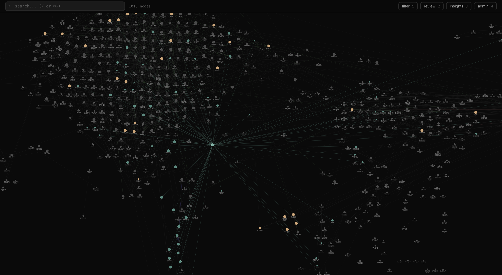

<p align="center">
  
</p>

<p align="center">
  <a href="https://pypi.org/project/ormah/"></a>
  <a href="https://pypi.org/project/ormah/"></a>
  <a href="LICENSE"></a>
  <a href="https://www.ormah.me/docs/getting-started/quickstart"></a>
  <a href="https://discord.gg/guBU6XweBu"></a>
</p>

**The collective, self-maintaining memory layer all your agents can tap into.**

The core idea is simple: memory should be involuntary. Your agents should not have to remember to remember. Ormah works in the background, learning your preferences, decisions, patterns, mistakes, and ongoing work, then whispering the right memory at the right time.

Your memory has always been yours. Ormah helps keep it that way.

**Local. Private. Portable. Yours to keep. Yours to move.**

```bash
bash <(curl -fsSL https://ormah.me/install.sh)
```

<p align="center">
  <a href="https://www.youtube.com/watch?v=IngB55jdnlc">
    
  </a>
</p>

<p align="center"><a href="https://www.youtube.com/watch?v=IngB55jdnlc">▶ Watch Ormah in action</a></p>

The name comes from the Malayalam word ഓർമ (`ormah`), meaning "memory" or "remember."

## Memory Should Whisper

In real life, memory does not work like search. When something in front of you connects to something you already know, the memory surfaces on its own. You do not stop and decide to remember.

Ormah is built around that idea. Instead of waiting for an agent to ask for context, Ormah looks at what is happening and whispers the right memory before the agent processes the next prompt, so it starts with the context, preferences, constraints, and hints that matter.

That is what makes Ormah feel like memory instead of search. Search waits to be asked. Memory shows up when it matters.

Silence is better than noise. Ormah should whisper, not shout.

## Install

### Desktop App

<p>
  <a href="https://www.ormah.me/download/mac"></a>
  &nbsp;
  <a href="https://www.ormah.me/download/linux"></a>
</p>

No Python or terminal required. Download, open, and Ormah sets itself up.

### Terminal

```bash
bash <(curl -fsSL https://ormah.me/install.sh)
```

One command gets you a working local Ormah runtime with setup for supported clients.

### Claude Code Plugin

1. Add the marketplace and install the plugin:

   ```
   /plugin marketplace add r-spade/ormah
   /plugin install ormah@ormah
   ```

2. Reload: `/reload-plugins`
3. Run `/ormah:setup`
4. Check that the Ormah MCP server is enabled via `/mcp` — if not, enable it there

Ormah is agent-agnostic by design. It can be wired into any agent that exposes the right hook or prompt-injection path, and it also exposes CLI, MCP, and HTTP surfaces.

`ormah setup` will:

1. Start the Ormah server and install auto-start
2. Preload the local models used for search and whisper retrieval
3. Detect supported clients and wire them up automatically
4. Offer agent-backed maintenance when Claude Code, Codex, or Pi are available
5. Offer transcript backfill to help bootstrap memory from earlier sessions

Today, setup can wire up:

- Claude Code
- Codex
- Claude Desktop (MCP)
- Pi

Local search, embeddings, storage, the graph UI, and whisper retrieval do not require an API key. If you want Ormah's LLM-backed features to run independently of your agent, setup can opt into a provider explicitly. Ormah stores only provider policy in `~/.config/ormah/.env`; it does not copy API key values into its config. Local Ollama generation uses a configurable `ORMAH_LLM_NUM_PREDICT` token budget.

## Features

### Recall and Whisper

Ormah supports both deliberate recall and involuntary recall.

When an agent knows it needs something, it can explicitly search memory. But memory should not always wait to be asked. Ormah is built to whisper the right memory at the right time, before the next prompt, so the agent starts with context instead of having to go looking for it.

Whisper evaluates standing preferences through a separate applicability path. This lets a rule govern a task even when it does not read like a passage that directly answers the prompt, without allowing preference guesses to suppress ordinary factual retrieval.

Whisper feedback can learn from transcript files after they stop changing: a local heuristic records clear usage for free, and an optional LLM judge can classify ambiguous turns into positive, negative, or uncertain retrieval signals.

Read more: [Whisper - Involuntary Recall](https://www.ormah.me/docs/how-ormah-works/whisper), [Search and Ranking](https://www.ormah.me/docs/how-ormah-works/search-and-ranking), [Affinity and Feedback](https://www.ormah.me/docs/operations/affinity-and-feedback)

### Memory Capture

Memory is only useful if it keeps growing with you.

Ormah can capture memory from ongoing sessions, stored transcripts, and external markdown sources. `whisper store` turns conversations into durable memory, the session watcher ingests completed sessions automatically, and Hippocampus watches note directories so project docs, journals, and markdown knowledge can flow into the graph over time.

Read more: [Hippocampus and Session Watcher](https://www.ormah.me/docs/operations/hippocampus-and-session-watcher), [Storage Layer](https://www.ormah.me/docs/how-ormah-works/storage-layer)

### Self-Maintaining Memory

Memory should not become a junk drawer.

Ormah continuously maintains the graph in the background: linking related memories, detecting conflicts, tracking belief evolution, merging duplicates, consolidating overlap, scoring importance, and decaying stale context. Some of that work is automatic, and some of it can be delegated to an agent when judgment is required.

Read more: [Background Jobs](https://www.ormah.me/docs/how-ormah-works/background-jobs)

### Local Backups

Memories should be hard to lose.

Ormah can create timestamped local backups of the source-of-truth memory files and keeps the latest 10 by default. Backups include active and deleted memory nodes, but exclude derived indexes, logs, config, and API keys. When memory nodes exist, the server checks for a due backup in the background. Manual workflows are available through `ormah backup create`, `ormah backup list`, `ormah backup status`, and `ormah backup restore`.

Read more: [Configuration Reference](https://www.ormah.me/docs/operations/configuration-reference)

### Cloud Account

Sign in with an emailed one-time code using `ormah account login`. Use
`ormah account status` to inspect the cached paid-tier entitlement and
`ormah account logout` to revoke this device token and remove local account
credentials. Cloud entitlement checks tolerate temporary outages; they never
gate local backups or cloud downloads.

### Cloud Backup (Paid)

Ormah can encrypt local memory backups on your machine and upload only the
ciphertext to Ormah Cloud. Sign in, initialize the store key, and enable the
scheduled uploader:

```bash
ormah account login
ormah cloud init
# Add ORMAH_CLOUD_BACKUP_ENABLED=true to ~/.config/ormah/.env
ormah backup status
```

The recovery kit written by `ormah cloud init` contains every identity needed
to decrypt current and pre-rotation snapshots, plus the store ID that locates
them. Keep it offline and separate from the machine and cloud account it
protects. Anyone with the kit can read the backups; without it, nobody can,
including Ormah.

`ormah uninstall` removes local data and account configuration, but it always
preserves `~/.config/ormah/cloud.key` and
`~/.config/ormah/ormah-recovery-kit.md`. Before deleting anything, uninstall
verifies that the kit contains the current encryption identities and store ID,
and safely refreshes a missing or stale kit when the local key and store ID are
available. If complete recovery cannot be guaranteed, uninstall stops without
removing data or integrations. Deleting the preserved files manually can make
encrypted cloud backups permanently unreadable.

Restore on a new machine with:

```bash
ormah account login
ormah cloud init --import-key /path/to/ormah-recovery-kit.md
ormah backup restore --cloud --yes
```

Cloud downloads remain available when a paid entitlement expires. The restore
command verifies the encrypted bundle manifest and every file hash before it
delegates to the normal local restore path. A weekly background job also
downloads the latest committed snapshot, rebuilds a scratch index, and probes
search without touching the live memory directory. `ormah backup status` and
the admin panel report the last snapshot proven restorable.

The hosted service never receives key material, plaintext, or blob bytes. It
stores account and snapshot metadata and issues short-lived object-store URLs;
encryption, decryption, hashing, upload, and restore all happen on the client.

### Agent-Agnostic Surfaces

Ormah is not tied to a single agent.

It can integrate wherever there is a usable hook or interface. Ormah exposes multiple surfaces for that: hooks for whisper, MCP for tool-calling agents, a CLI for direct workflows, and an HTTP API for custom integrations. The memory layer stays the same even when the agent changes.

Read more: [MCP and Adapters](https://www.ormah.me/docs/integrations/mcp-and-adapters), [API Surface](https://www.ormah.me/docs/reference/api-surface), [Installation](https://www.ormah.me/docs/getting-started/installation), [Setup](https://www.ormah.me/docs/getting-started/setup)

### Agent-Assisted or Independent

Ormah can use the intelligence of the agents you already work with, like Codex or Claude Code, for judgment-heavy tasks such as maintenance. But it does not have to depend on them. If you want Ormah to run those features independently, you can configure your own provider and API key.

Read more: [Configuration Reference](https://www.ormah.me/docs/operations/configuration-reference), [Installation](https://www.ormah.me/docs/getting-started/installation), [Setup](https://www.ormah.me/docs/getting-started/setup)

### Graph UI

Memory should be inspectable.

Ormah includes a graph UI so you can see what it knows, how memories connect, what is becoming central, and where conflicts or belief changes are forming. That makes the system easier to trust, debug, and improve.

The graph UI includes dark/light themes plus browser-persisted controls for tier colors.

Read more: [Web UI](<docs/14 - Web UI.md>)

## Integrations

Ormah is agent-agnostic, but it already has first-class integrations for:

- Claude Code — whisper hooks, MCP, transcript backfill, maintenance agent
- Codex — whisper hooks, MCP, maintenance agent
- Claude Desktop (macOS) — MCP
- Pi — whisper inject, memory tools, transcript capture, maintenance agent (install with `pi install npm:ormah-pi`)

It can also be used through:

- MCP for compatible clients
- the CLI for terminal workflows
- the HTTP API for local apps and custom integrations
- OpenAI-compatible tool schemas for custom tool-calling stacks

Main integration surfaces:

- Hooks — whisper before the next prompt
- MCP — `remember`, `recall`, `recall_node`, `mark_outdated`, `submit_feedback`, `run_maintenance`
- CLI — setup, server management, memory ops, ingestion, whisper hooks, evals
- HTTP API — `/agent/*`, `/admin/*`, `/ingest/*`, `/ui/*`

Read more: [Installation](https://www.ormah.me/docs/getting-started/installation), [Setup](https://www.ormah.me/docs/getting-started/setup), [MCP and Adapters](https://www.ormah.me/docs/integrations/mcp-and-adapters), [API Surface](https://www.ormah.me/docs/reference/api-surface), [Configuration Reference](https://www.ormah.me/docs/operations/configuration-reference)

## Community

Join the [Ormah Discord](https://discord.gg/guBU6XweBu) for help, feature discussion, and updates.

## Development

```bash
git clone https://github.com/r-spade/ormah.git
cd ormah
make install
uv run pytest
```

### Retrieval evals

Two golden-corpus eval harnesses measure retrieval quality from a source checkout:

```bash
make eval                       # whisper + recall evals with fail-below quality bars
ormah eval whisper run          # whisper pipeline eval (--show-failures, --category, --fail-below)
ormah eval recall run           # recall/retrieval eval (--fail-below)
ormah eval whisper mine         # mine provisional cases from your live whisper_log (read-only)
ormah eval whisper import-labels  # confirm mined labels after human review
```

Eval corpora are intentionally **local-only and gitignored**: they seed real
memories from the developer's own usage, so they never ship in the repo. See
`eval/whisper/corpus/README.md` for the case-design and honest-labeling rules.
CI runs tests and lint only; eval bars are enforced locally via `make eval`.

## Release Process

Releases are published through the manual GitHub Actions `Release` workflow. The workflow
is guarded so only the GitHub login listed in `RELEASE_ALLOWED_ACTOR` can run the release
path.

Before running the workflow:

1. Bump `pyproject.toml`.
2. Bump `integrations/claude-plugin/.claude-plugin/plugin.json` to the same version.
3. Merge the release PR to `main`.

Then open GitHub Actions, run `Release` from `main`, and enter the version without the
leading `v`, for example `0.12.0`.

The workflow verifies that the requested version matches `pyproject.toml`, verifies that
the Claude plugin manifest has the same version, runs the Python test suite with
`ORMAH_LLM_PROVIDER=none`, builds the UI, builds one wheel, publishes that wheel to PyPI,
creates `v<version>`, and creates the GitHub Release with generated notes.

PyPI publishing uses Trusted Publishing. No long-lived PyPI token is stored in the repo,
local `.env`, or developer machines. The PyPI project should trust this repository,
`.github/workflows/release.yml`, and the `pypi` GitHub environment.

Protect the `pypi` GitHub environment with the release manager as the required reviewer.
Do not enable prevent-self-review unless a second reviewer is intentionally required for
every release. If Trusted Publishing is not configured yet, use a project-scoped PyPI API
token only as a temporary environment-scoped GitHub Actions secret.

## License

MIT
