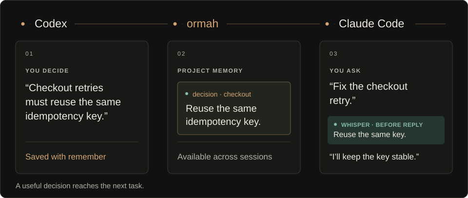
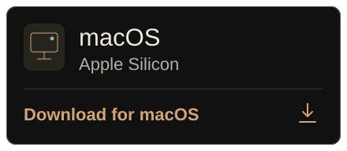
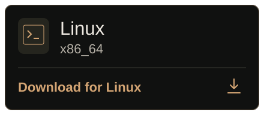

<picture>
  <source media="(max-width: 640px)" srcset="docs/assets/readme/hero-narrow.svg">
  
</picture>

**Your memory has always been yours.**<br>Ormah helps keep it that way.

**Local. Private. Portable. Yours to keep. Yours to move.**

The more an AI knows you, the harder it can feel to leave. But your preferences, decisions, and history shouldn't be what ties you to one company. They're part of what makes you, you. You should be able to change tools without leaving that part of yourself behind.

Ormah gives your AI agents a shared memory. It keeps useful context between sessions and, with supported integrations, whispers relevant memories before the agent replies.

**[Get started](#get-started)** · [Watch the original demo](https://www.youtube.com/watch?v=IngB55jdnlc) · [Explore the docs](docs/00%20-%20Ormah%20Overview.md)

## Move between agents. Keep your context.

*Illustrative example. Codex and Claude Code are connected to the same Ormah store and project.*

<picture>
  <source media="(max-width: 640px)" srcset="docs/assets/readme/shared-memory-narrow.svg">
  
</picture>

1. **Decide in Codex.** “Checkout retries must reuse the same idempotency key.” Codex saves the decision with Ormah's `remember` tool.
2. **Keep it in Ormah.** The decision belongs to the project's shared memory, available beyond this conversation.
3. **Continue in Claude Code.** You ask, “Fix the checkout retry.” Whisper supplies the saved decision before the reply, so Claude can keep the key stable without being asked to search memory.

<a href="https://www.youtube.com/watch?v=IngB55jdnlc">
  <picture>
    <source media="(max-width: 640px)" srcset="docs/assets/readme/demo-link-narrow.svg">
    
  </picture>
</a>

## Get started

**Your memory starts here.** Download the desktop app for your platform.

<p>
  <a href="https://www.ormah.me/download/mac"></a>
  <a href="https://www.ormah.me/download/linux"></a>
</p>

Open Ormah and follow setup to connect your agents. [All releases](https://github.com/r-spade/ormah/releases) · [Setup guide](docs/11%20-%20Setup%20and%20Installation.md#setup-wizard)

**Try your first memory.** In a connected agent, ask: “Remember that checkout retries must reuse the same idempotency key.” Then start a new session in the same project and ask: “What key should checkout retries use?”

With a Whisper integration enabled, the saved decision can arrive before the agent replies. To check automatic delivery, inspect the client's hook/context output for the injected memory.

### Prefer the terminal?

On **macOS or Linux**, run:

```bash
bash <(curl -fsSL https://ormah.me/install.sh)
```

The installer installs Ormah and opens setup. Setup downloads the local retrieval models, starts the server, and connects detected supported clients. Choose agent-backed maintenance if you want your coding agent to handle graph cleanup. Local search and Whisper retrieval need no separate model API key.

[Manual and Claude Code plugin installation →](docs/11%20-%20Setup%20and%20Installation.md#installation)

<details>
<summary>Check installation and memory from the terminal</summary>

From your project directory:

```bash
ormah server status
ormah remember "Checkout retries reuse the same idempotency key." --type decision
ormah recall "checkout retries"
```

Success means the server reports that it is running and recall returns the decision you just stored. Open the [local graph](http://localhost:8787/ui) to inspect it.

</details>

[Setup and troubleshooting →](docs/11%20-%20Setup%20and%20Installation.md#setup-wizard)

## Memory that stays useful

- **Relevant context appears automatically.** Whisper checks the current prompt and surfaces memories that fit. It can stay quiet when there is nothing useful to add.
- **Your agents share what matters.** Decisions, preferences, and ongoing work can carry between connected agents using the same store.
- **Memory changes with your work.** Ormah can link related memories, flag conflicts, merge duplicates, and let stale context recede. Background jobs and optional agent-backed maintenance keep the graph useful over time.

## How it works

Your agents shouldn't have to remember to remember. Ormah brings capture, maintenance, and timely recall into the flow of work.

<picture>
  <source media="(max-width: 640px)" srcset="docs/assets/readme/memory-cycle-narrow.svg">
  
</picture>

1. **Learn.** Agents save preferences, decisions, patterns, mistakes, and ongoing work through memory tools. With an Ormah LLM provider configured, transcript extraction can also capture memories from sessions. Optional watchers can ingest transcripts and Markdown notes.
2. **Maintain.** Scheduled jobs handle tasks such as decay and importance scoring. Judgment-heavy cleanup uses your agent when enabled, or a configured Ormah LLM provider.
3. **Whisper.** A supported client asks Ormah for relevant context before the agent replies. Ormah selects memories from the shared store and returns them to the conversation. Explicit recall is available whenever the agent needs to look further.

Choosing agent-backed maintenance during setup leaves server-side LLM extraction off. Enable a provider separately if you want transcript extraction too. [Capture and watchers](docs/10%20-%20Hippocampus%20and%20Session%20Watcher.md) · [Whisper](docs/04%20-%20Whisper%20-%20Involuntary%20Recall.md) · [Background jobs](docs/05%20-%20Background%20Jobs.md)

## Your memory, under your control

Memories live as readable Markdown files with metadata in `~/.local/share/ormah/memory/nodes/` by default. You can inspect them, keep local backups, and restore them on another machine. The search index is rebuilt from those files.

Storage and retrieval run locally by default. Memories supplied to an agent are processed by that agent's model; optional remote model providers process the content sent to them. You choose those connections.

Optional paid cloud backup encrypts snapshots on your device before upload. Keep the recovery kit: it contains the keys needed to restore them. Cloud backup provides recovery snapshots, not automatic live synchronization between devices.

[Storage](docs/02%20-%20Storage%20Layer.md) · [Backup, verification, and restore](docs/15%20-%20Cloud%20Backup%2C%20Verification%2C%20and%20Restore.md)

## Connect your agents

| Client | Memory tools | Automatic Whisper |
| --- | --- | --- |
| Claude Code | MCP | Prompt hook |
| Codex CLI | MCP | Prompt hook, enabled by setup |
| Pi | Ormah extension | Before each agent turn |
| Claude Desktop on macOS | MCP | Tool access only |

Hooks need a compatible client version and a running Ormah server. Other clients can connect through MCP, the HTTP API, or custom tool schemas; automatic injection needs a client integration.

[Client setup](docs/11%20-%20Setup%20and%20Installation.md#setup-wizard) · [Pi integration](integrations/pi-plugin/SETUP.md) · [MCP and adapters](docs/07%20-%20MCP%20and%20Adapters.md)

## Go further

- [Quickstart](docs/11%20-%20Setup%20and%20Installation.md) — installation and first checks.
- [System overview](docs/00%20-%20Ormah%20Overview.md) — how the pieces fit together.
- [Configuration](docs/12%20-%20Configuration%20Reference.md) — providers, capture, maintenance, and backups.
- [API reference](docs/08%20-%20API%20Surface.md) — build your own integration.

## Contribute

Start with the [contributing guide](CONTRIBUTING.md). Help improve an integration, clarify a guide, or report a reproducible problem in [GitHub Issues](https://github.com/r-spade/ormah/issues). Join the [Ormah Discord](https://discord.gg/guBU6XweBu) for discussion and help.

<details>
<summary>Develop locally</summary>

Use Python 3.11+, Node.js/npm, and Make. In an activated Python virtual environment:

```bash
git clone https://github.com/r-spade/ormah.git
cd ormah
make install
python -m pytest
```

See the [Makefile](Makefile) for backend and UI development commands. The [retrieval eval guide](docs/13%20-%20Eval%20Framework.md) covers local evaluation; evaluation corpora are not included in the repository.

</details>

[MIT licensed](LICENSE).
