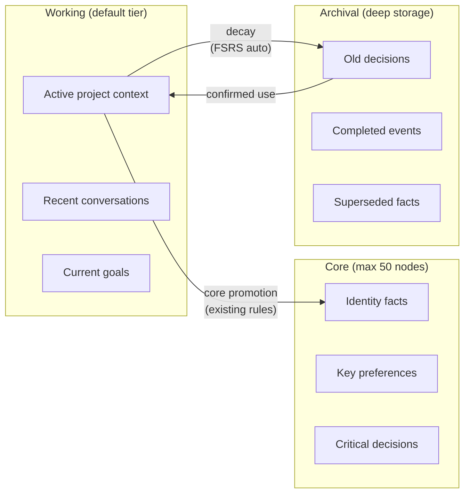
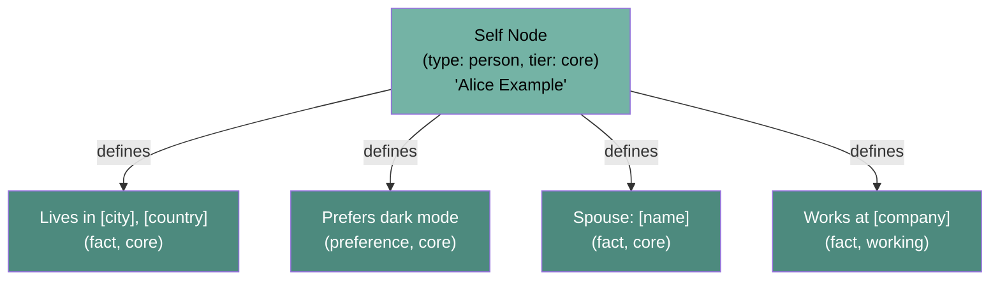

# Data Model

All data models live in `src/ormah/models/` and use Pydantic for validation and serialization.

## MemoryNode

The core entity. Every memory is a `MemoryNode` (`models/node.py`).

### Fields

```yaml
# Identity
id: UUID                    # Unique identifier
short_id: str               # First UUID segment (e.g., "97acbe8e") - property

# Classification
type: NodeType              # What kind of memory (see below)
tier: Tier                  # Priority level: core | working | archival
space: str | None           # Project namespace (e.g., "ormah", None = global)

# Content
title: str | None           # Optional title (10x weight in FTS search)
content: str                # The actual memory text
tags: list[str]             # Categorization tags (e.g., ["about_self", "location"])
source: str                 # Origin: "agent:claude-code", "system:self", etc.

# Graph
connections: list[Connection]  # Outgoing edges to other nodes

# Scoring
confidence: float           # [0.0-1.0] How certain we are (default: 1.0)
importance: float           # [0.0-1.0] Computed by importance_scorer job; see 05 - Background Jobs
access_count: int           # Confirmed-use count (not search/result surfacing)

# Temporal
created: datetime           # When first stored (UTC)
updated: datetime           # Last modification (UTC)
last_accessed: datetime     # Last confirmed use, or creation before first use
last_review: datetime | None # Last numeric stability update; separate from last_accessed
valid_until: datetime | None # Expiry date (set by mark_outdated)

# FSRS (Spaced Repetition)
stability: float            # Days until ~37% retrievability (default: ~5.814)
consolidated_into: str | None # Explicit consolidation supersession replacement ID
```

### Connection

A directed, typed, weighted edge from one node to another:

```python
class Connection(BaseModel):
    target: str          # Target node UUID
    edge: EdgeType       # Relationship type (default: related_to)
    weight: float        # Strength 0.0-1.0 (default: 0.5)
```

## Node Types (10 types)

Defined as `NodeType` enum in `models/node.py`:

| Type | Purpose | Example |
|------|---------|---------|
| `fact` | Static, verifiable information | "Lives in Dublin, Ireland" |
| `decision` | A choice + its reasoning | "Chose SQLite over Postgres for local-first" |
| `preference` | How the user likes to work | "Prefers map/filter over for loops" |
| `event` | Time-bound occurrence | "AI Tinkerers presentation - April 2026" |
| `person` | An individual | "Rishikesh Chirammel Ajit" |
| `project` | Project metadata | "Ormah - AI agent memory system" |
| `concept` | Abstract idea or pattern | "Three-tier memory model" |
| `procedure` | Step-by-step process | "How to deploy ormah to production" |
| `goal` | An objective | "Make ormah frictionless to install" |
| `observation` | A surprising finding | "BGE query prefix is net-neutral for recall" |

## Three Tiers

Defined as `Tier` enum. These map conceptually to human memory systems:



| Tier | Cap | Decay | Search Boost | Purpose |
|------|-----|-------|-------------|---------|
| **core** | 50 nodes | Protected from decay | +0.10 | Always-relevant: identity, key preferences, critical decisions |
| **working** | Unlimited | FSRS-based auto-demotion | +0.00 | Active context: current project info, recent decisions |
| **archival** | Unlimited | No further decay | -0.10 | Historical: still searchable but deprioritized |

**Core cap enforcement** (`engine/tier_manager.py:enforce_core_cap()`): When core exceeds 50 nodes, the least important ones (by `importance` score, not raw access count) are demoted to working, skipping protected nodes like the self node. See [05 - Background Jobs](<./05 - Background Jobs.md>) for how importance is calculated.

## Edge Types (8 types)

Defined as `EdgeType` enum. Each has a spreading activation factor used during graph traversal:

| Edge Type | Activation Factor | Created By | Purpose |
|-----------|:-----------------:|-----------|---------|
| `supports` | 1.0 | Auto-linker (LLM) | Strong supporting evidence |
| `part_of` | 1.0 | Auto-linker (LLM) | Hierarchical containment |
| `depends_on` | 1.0 | Auto-linker (LLM) | Logical dependency |
| `defines` | 1.0 | System (identity) | Links self node to identity facts |
| `derived_from` | 1.0 | Consolidator | Lineage after consolidation |
| `evolved_from` | 0.8 | Conflict detector | Belief changed over time |
| `related_to` | 0.7 | Auto-linker (LLM) | Generic semantic connection |
| `contradicts` | 0.4 | Conflict detector | Active contradiction (low weight intentional) |

The activation factors are defined in `engine/memory_engine.py:64-73` and control how strongly a neighbor's relevance propagates during spreading activation search.

## Identity System

Users have a **self node** -- a special `person`-type, `core`-tier node that represents the user themselves.



**Key design decision**: identity membership is represented structurally in the graph, not inferred from tier labels.

In practice, Ormah starts from the self node and follows `defines` edges to find memories that describe the user. That means:

- `tier` answers "how important / always-loaded / demotable is this memory?"
- `defines` answers "is this memory part of the user's identity?"

Those are different concerns. A memory can be identity-related and still live in `core`, `working`, or `archival`. For example, if "Works at company X" is demoted from `core` to `working`, Ormah can still find it as identity because the graph still says:

```text
Self --defines--> Works at company X
```

This avoids a brittle design where identity retrieval would break whenever tier rules change.

Important nuance for the current implementation: the graph edge path is the **identity anchor**, but whisper does not rely on graph traversal alone. For identity prompts, it still runs search as well, because search can surface user-related facts that are not directly reachable from the self node.

When a memory is created with `about_self=True`:
1. The node gets an `about_self` tag
2. A `defines` edge is created from the self node to the new node (`memory_engine.py:_link_to_self()`)
3. The consolidator preserves these edges when merging identity-related clusters

Identity nodes are tagged with `about_self` which also triggers special FTS behavior -- queries containing "me", "I", "my" get `about_self` injected into the search terms (`index/graph.py:_sanitize_fts_query()`).

## Request/Response Models

### CreateNodeRequest (`models/node.py`)

Used by the `remember` tool:

```python
class CreateNodeRequest(BaseModel):
    content: str              # Required: the memory text
    type: NodeType = "fact"   # Default: fact
    tier: Tier = "working"    # Default: working
    source: str = "agent:unknown"
    space: str | None = None
    tags: list[str] = []
    connections: list[Connection] = []
    title: str | None = None
    about_self: bool = False  # Create defines edge from self node
    confidence: float = 1.0
```

### SearchQuery (`models/search.py`)

Used by the `recall` tool:

```python
class SearchQuery(BaseModel):
    query: str                        # Search text
    limit: int = 10                   # 1-100
    types: list[NodeType] | None      # Filter by node type
    tiers: list[Tier] | None          # Filter by tier
    spaces: list[str] | None          # Filter by project space
    tags: list[str] | None            # Filter by tag
    created_after: str | None         # ISO date filter
    created_before: str | None        # ISO date filter
    session_id: str | None            # For session-aware whisper
```

### Proposal (`models/proposals.py`)

Used by background maintenance jobs:

```python
class Proposal(BaseModel):
    id: UUID
    type: ProposalType    # merge | conflict | decay
    status: ProposalStatus # pending | approved | rejected
    source_nodes: list[str] # Node IDs involved
    proposed_action: str    # What to do
    reason: str | None      # Why
    created: datetime
    resolved: datetime | None
```

## Walkthrough Example: Creating a Memory

Imagine you tell Claude: "Remember that I prefer using TypeScript over JavaScript"

1. **MCP adapter** receives `remember` call with `content="User prefers TypeScript over JavaScript"`, `about_self=True`
2. **API route** creates a `CreateNodeRequest` with `type=preference`, `tier=working`
3. **MemoryEngine.remember()** (`engine/memory_engine.py`):
   - Creates a `MemoryNode` with UUID, timestamps, default scores
   - `FileStore.save()` writes `preference_prefers-typescript_97acbe8e.md` atomically
   - `IndexBuilder.index_single()` inserts into SQLite FTS5 + tags
   - `VectorStore.upsert()` stores the BGE embedding (768-dim)
   - `_link_to_self()` creates a `defines` edge from self node → this node
   - `_auto_link_node()` searches for similar nodes, creates edges if similarity > 0.65
   - `TierManager.enforce_core_cap()` checks if core tier is over 50 nodes
4. **Result**: Node stored on disk, indexed in SQLite, linked in graph, ready for whisper recall
