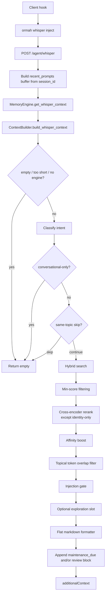
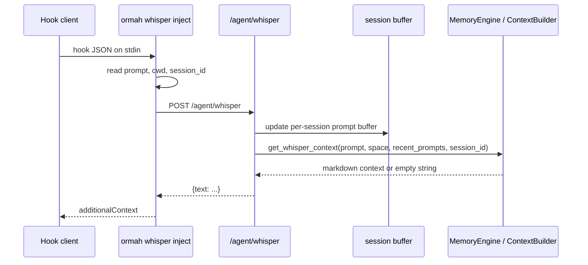

# Whisper - Involuntary Recall

Verified against the current repository state on 2026-04-13.

Whisper is Ormah's pre-response memory injection path. A client asks for context before the agent answers, and Ormah decides whether any memories are relevant enough to inject.

The current implementation is a branching pipeline with early exits, session-aware query enhancement, hybrid retrieval, reranking, affinity boosting, gating, and a flat markdown formatter.

The core whisper logic is agent-harness agnostic. Clients can invoke whisper through the `ormah whisper inject` and `ormah whisper store` CLI commands, or call the HTTP route directly.

## Entry Points

- CLI hook command: `src/ormah/adapters/cli_adapter.py:cmd_whisper_inject()`
- API route: `src/ormah/api/routes_agent.py:/agent/whisper`
- Engine entry: `src/ormah/engine/memory_engine.py:get_whisper_context()`
- Builder: `src/ormah/engine/context_builder.py:build_whisper_context()`

## High-Level Flow



## Session Buffering

The `/agent/whisper` route maintains an in-memory ring buffer keyed by `session_id`.

- first prompt in a session: `recent_prompts = None`
- later prompts: `recent_prompts` is a bounded list of prior prompts
- entries older than `whisper_session_gap_minutes` are pruned

This matters because follow-up prompts use recent prompts to enrich the search query.

## What The Builder Actually Does

### 1. Early exits

The builder returns nothing when:

- the prompt is empty
- the prompt is effectively only punctuation / <= 2 alphanumeric characters
- there is no engine instance

### 2. Intent classification happens before topic-shift skip

The prompt is classified first. That classification drives later branching:

- conversational-only prompts skip injection entirely
- continuation prompts enable search-query enrichment
- identity prompts skip the reranker path
- temporal prompts relax some thresholds and are later sorted by recency

### 3. Topic-shift skip only applies to non-follow-ups

If there are recent prompts and the prompt is **not** a continuation follow-up, Ormah compares the current prompt embedding with the centroid of the last few prompts. If similarity is above `whisper_topic_shift_threshold` (default `0.75`), whisper is skipped.

### 4. Identity support uses both graph and search

The code loads identity-linked neighbors from the self node when available, but it does **not** rely only on graph fallback for identity queries. It still runs hybrid search because search can surface identity-related facts that are not directly reachable through the self node.

### 5. Query enhancement is selective

The search query is only expanded for follow-up prompts:

- base query: current prompt
- continuation query: `recent_prompts[-2:] + [prompt]`

This is intentionally narrower than "always combine recent prompts".

### 6. Hybrid search uses whisper settings directly

The builder calls structured recall with:

- `limit = whisper_max_nodes * whisper_candidate_pool_multiplier` (defaults `6 * 5 = 30`) — a deep candidate pool so the reranker and gate can rescue memories the bi-encoder under-ranked; the final injected set is still capped at `whisper_max_nodes`
- `tiers = [core, working]`
- search never writes lifecycle fields (`access_count`, `last_accessed`, `stability`, `last_review`) — that write happens only on confirmed use

### 7. Thresholds and reranking

- base whisper min relevance score: `0.45`
- temporal queries can relax the effective floor
- reranker is enabled by default
- reranker is **skipped for identity-only queries**
- reranker model default: `Xenova/ms-marco-MiniLM-L-6-v2`

### 8. Affinity boost happens after reranking

Affinity uses stored feedback rows from the `affinity` table to nudge scores up or down based on similar prior prompt contexts. The current default implicit weight is `0.8`.

### 9. Topical token overlap is a late precision filter

After retrieval, reranking, and affinity boost, whisper extracts topic tokens from the current prompt and checks which candidate nodes still have explicit topical overlap with that prompt.

- candidates with topical overlap always pass
- identity-linked nodes are still allowed through this filter
- for identity-only prompts, global identity candidates are also preserved
- a candidate with **no** overlap needs an absolute voucher: `ce_absolute >= whisper_no_overlap_ce_floor` (default 0.45), or `raw_cosine >= whisper_no_overlap_cosine_floor` (default 0.70) when the reranker didn't run — the filter fails closed instead of passing everything when nothing overlaps

This step exists because semantic retrieval can surface broadly related memories that are directionally relevant but too vague for injection. Token overlap adds one more precision pass before the final gate.

### 10. Injection gate is `0.50`

The hard gate is controlled by `whisper_injection_gate`, which currently defaults to `0.50`, not `0.55`.

- if the best non-temporal result is below the gate: whisper returns empty
- otherwise weak candidates below the gate are removed

### 11. Exploration slot is optional

If enabled, Ormah can add one lower-confidence candidate as an exploration slot. This is meant to create learning opportunities for later feedback.

- exploration only piggybacks on real injections: when the gate decided on silence, silence stands
- the exploration candidate is rendered with an `[exploring]` marker instead of its type, so agents can weigh it honestly

Topic-shift suppression ("same topic → skip") only fires for topics that were actually **served** — if every earlier prompt on the topic produced silence, whisper proceeds instead of starving the topic for the whole session (served history is read from `whisper_log`).

### 12. Formatting is flat, not sectioned

Current output format:

- heading: `# Ormah whispers`
- ranked flat list of memories
- top `2` results include content, capped at `whisper_injected_content_max_chars` (default `600`) at a word boundary — the full node stays one `recall_node` call away
- remaining results include title, type, and short id only

There is no current formatter that splits output into `About the User`, `Core Memories`, and `Project` sections.

## Current Output Shape

```markdown
# Ormah whispers
The most relevant memories are shown in full. The rest are titles only. If any
memory looks relevant or interesting, use recall with its node ID to get the
full content and related memories.

- **[decision]** Ormah uses FastAPI + SQLite with hybrid search (id: 97acbe8e)
  Ormah serves FastAPI routes, persists markdown nodes locally, and derives a
  SQLite index with FTS5 and vector search.

- **[fact]** Whisper eval runner seeds an isolated DB (id: a1b2c3d4)
  The eval pipeline builds an isolated engine, runs whisper, and records
  injected ids for scoring.

- **[concept]** Session watcher ingests transcript files into memory (id: e5f6g7h8)

maintenance_due
```

Two important notes:

- `maintenance_due` is appended as a bare line when enabled and due
- on the first message of a session, Ormah may also append a review block for an older gated-out candidate, but only when the final main, preference, or exploration selection already contains an admitted memory; maintenance output never qualifies

## Session Hook Flow



## Nudge and Periodic Store

`ormah whisper inject` also manages two adjacent behaviors:

- every `whisper_nudge_interval` prompts, it appends a reminder to use `remember`
- every `whisper_out_interval` prompts, it can spawn `ormah whisper store` in the background to extract memories from the transcript

Those behaviors are outside the selection logic in `ContextBuilder`, but they are part of the end-to-end whisper hook path used by hook-based integrations.

## Walkthrough Example

Prompt: `how does the whisper eval pipeline work?`

1. route receives the prompt and session id
2. if this is a first turn, `recent_prompts` is `None`
3. the prompt is classified as a technical/general query, not conversational-only
4. hybrid search runs with `limit=6` over `core` and `working` nodes
5. reranker refines ordering
6. affinity may boost nodes with matching prior feedback
7. if the best score clears `0.50`, the top results are formatted
8. the first two results get full content; the rest are title-only

Mental model: whisper is now a **precision-oriented retrieval and formatting path**, not a large context dump.

## Code Anchors

- `src/ormah/adapters/cli_adapter.py`
- `src/ormah/api/routes_agent.py`
- `src/ormah/engine/memory_engine.py`
- `src/ormah/engine/context_builder.py`
- `src/ormah/engine/prompt_classifier.py`
- `src/ormah/engine/affinity.py`
