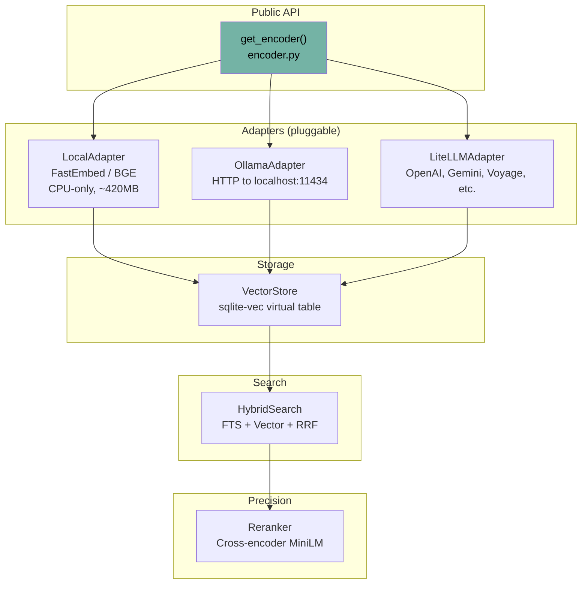
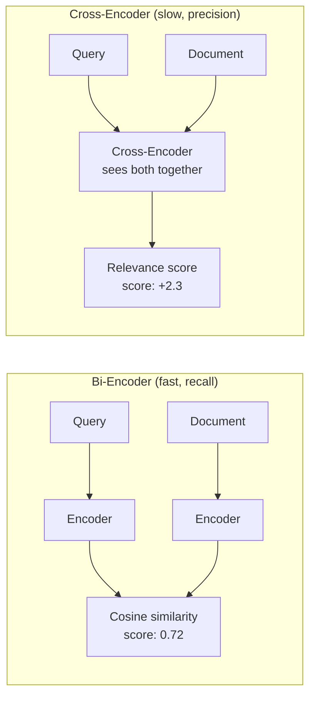

# Embeddings System

Verified against the current repository state on 2026-04-13.

The embeddings subsystem powers vector search, similarity detection, and cross-encoder reranking. It also provides the encoder used by prompt-intent classification. Most of the implementation lives in `src/ormah/embeddings/`.

## Architecture



## Embedding Adapter Interface

**Code**: `embeddings/base.py`

```python
class EmbeddingAdapter(ABC):
    @abstractmethod
    def encode(self, text: str) -> np.ndarray:
        """Single text → L2-normalized vector"""

    @abstractmethod
    def encode_batch(self, texts: list[str], batch_size: int = 32) -> np.ndarray:
        """Batch encoding → normalized vectors"""

    def encode_query(self, text: str) -> np.ndarray:
        """Query-specific encoding (may add prefix)"""

    @property
    @abstractmethod
    def dim(self) -> int:
        """Vector dimensionality"""
```

## Local Adapter (Default)

**Code**: `embeddings/local_adapter.py`

- **Model**: BAAI/bge-base-en-v1.5
- **Dimensions**: 768
- **Library**: FastEmbed (ONNX runtime, CPU-only)
- **Size**: ~420MB download on first use
- **Cache**: `~/.local/share/ormah/models/`

```python
# Query encoding adds special prefix automatically
model.query_embed("what database does ormah use?")
# → internally: "Represent this sentence for searching relevant passages: what database does ormah use?"

# Document encoding (no prefix)
model.embed("Chose SQLite over Postgres for local-first design")
```

**Lazy loading**: Model is downloaded and loaded on first `encode()` call. Subsequent calls use a module-level `_model_cache` singleton keyed by model name.

### Local inference memory limits

Local inference uses two process-wide reusable worker threads
(`embeddings/runtime.py`): one for whisper and other model work, and one
reserved for deliberate recall. The engine's `recall_search`, `recall_node`, and
`recall_search_structured` entry points select the recall lane, covering API,
MCP, UI, and direct engine callers. Whisper uses the neutral structured-search
helper; its single-text encodes and reranks stay on the general lane.
UI search shares the recall worker with agent recall, so these requests can
queue behind each other. Setup preloading uses the same model caches and
worker policy, including when invoked by the running desktop sidecar.

A scoped request context is copied through AnyIO and into inference workers,
then reset after completion or failure. Each lane runs one item at a time,
with at most two local inference items active across the process. Nested calls
execute inline on the current worker to avoid deadlock. FastEmbed's lazy
iterators are consumed before that item completes. Construction locks publish
fully initialized shared model instances without serializing warm inference.
Model caches retain their existing process lifetime; engine shutdown does not
unload process-wide models or shut down workers used by other engine instances.

Embedding and reranker batches contain at most eight inputs. `encode_batch`
clamps positive caller-supplied `batch_size` values to eight, including its
historical default of 32. Every input is processed in order, and query text
remains intact for the tokenizer's existing token window (512 tokens for the
default BGE and MS MARCO models).

Both local models receive FastEmbed's top-level `enable_cpu_mem_arena=False`
option, available since FastEmbed 0.7.4. Passing `session_options=` to these
FastEmbed wrappers is silently ignored. The worker and batch limits bound
inference concurrency, not total process RSS or native thread counts. ONNX
Runtime and the system allocator can still retain memory. Recalls may queue
behind other recalls, wait for cold model construction, and compete for CPU
with whisper. Remote embedding providers retain their existing behavior.

For opt-in diagnostics, enable DEBUG on `ormah.embeddings.runtime`. Each item
emits start and end records with an `inference` extra field. Both contain the
operation, request origin, and monotonic enqueue/start timestamps; the end
record also contains the end timestamp, queue wait, and execution duration.
Neither contains query or document text. Execution time includes model loading
when cold and CPU contention when busy. A structured logging handler can
retain these fields, as the benchmark script does.

On Linux/glibc, operators can separately evaluate `MALLOC_ARENA_MAX=2` in the
server process environment to limit allocator arenas. It is optional, may
trade allocator throughput for memory, and is not set by Ormah. A Python worker
is neither one CPU core nor exactly one allocator arena.

Issue [#322](https://github.com/r-spade/ormah/issues/322) can be reproduced in
a fresh process against cached real models and an isolated temporary store:

```bash
PYTHONPATH=src python scripts/diag/local_inference_memory.py \
  --cache-dir /path/to/model-cache --nodes 45 --concurrency 2 --rounds 1 \
  --rss-cap-mib 2800
```

The related startup re-embedding interruption described in #322 is separate:
the current rebuild computes all vectors before persisting chunks. These local
inference limits do not add restart checkpoints to that rebuild.

### Why BGE?

- Runs entirely on CPU (no GPU needed)
- 768 dimensions gives good precision without excessive storage
- Asymmetric retrieval: different encoding for queries vs documents improves recall
- ~420MB is acceptable for a local-first tool

## Ollama Adapter

**Code**: `embeddings/ollama_adapter.py`

For users running Ollama locally:

```python
# HTTP POST to http://localhost:11434/api/embed
response = httpx.post(f"{base_url}/api/embed", json={
    "model": "nomic-embed-text",  # default
    "input": [text]
})
```

- Batch processing with 32-item chunks
- Auto-normalization of returned vectors

## LiteLLM Adapter

**Code**: `embeddings/litellm_adapter.py`

For cloud-hosted embeddings (OpenAI, Gemini, Voyage, Mistral):

```python
# Uses litellm's unified interface
response = litellm.embedding(model="text-embedding-3-small", input=[text])
```

- Batch processing with 32-item chunks
- Auto-normalization

## Encoder Factory

**Code**: `embeddings/encoder.py`, `embeddings/__init__.py`

```python
def get_encoder(settings=None) -> EmbeddingAdapter:
    if settings is None:
        settings = default_settings
    return get_adapter(settings)

def get_adapter(settings) -> EmbeddingAdapter:
    if settings.embedding_provider == "local":
        return LocalAdapter(model_name=settings.embedding_model)
    if settings.embedding_provider == "ollama":
        return OllamaEmbeddingAdapter(
            model=settings.embedding_model,
            base_url=settings.llm_base_url,
            dim=settings.embedding_dim,
        )
    if settings.embedding_provider == "litellm":
        return LiteLLMEmbeddingAdapter(
            model=settings.embedding_model,
            dim=settings.embedding_dim,
        )
```

The current implementation caches one adapter per settings-object identity in a module-level `_adapter_cache`.

## Vector Store

**Code**: `embeddings/vector_store.py`

Wraps the `sqlite-vec` extension for vector storage and KNN search:

The backing store is the `node_vectors` sqlite-vec virtual table in the derived SQLite index.

```python
class VectorStore:
    def upsert(self, node_id: str, embedding: np.ndarray):
        """DELETE + INSERT in single transaction"""
        # Atomic: prevents reader seeing missing row

    def search(self, query_vec: np.ndarray, k: int) -> list[dict]:
        """KNN via sqlite-vec MATCH operator"""
        # SELECT id, distance FROM node_vectors
        # WHERE embedding MATCH ? AND k = ?
        # Returns L2 distance, converted:
        # cosine_similarity = 1 - (distance² / 2)

    def upsert_batch(self, items: list[tuple[str, np.ndarray]]):
        """Batch upsert in single transaction"""
```

### L2 to Cosine Conversion

sqlite-vec uses L2 (Euclidean) distance internally. For L2-normalized vectors (unit vectors), cosine similarity can be derived:

```
cosine_similarity = 1 - (L2_distance² / 2)
```

This works because for unit vectors: `||a - b||² = 2 - 2·cos(a,b)`, so `cos(a,b) = 1 - ||a-b||²/2`.

## Cross-Encoder Reranker

**Code**: `embeddings/reranker.py`

A precision filter used exclusively in the whisper pipeline. Unlike embeddings (which encode query and document separately), the cross-encoder sees both together.

### How It Works



**Model**: `cross-encoder/ms-marco-MiniLM-L-6-v2`
- Input: (query, document) pairs
- Output: raw score in [-12, +6] range
- Positive = relevant, negative = irrelevant

### Linear Rescale

```python
def _linear_rescale(ce_score: float) -> float:
    """Maps [-12, +6] → [0, 1] linearly"""
    return max(0.0, min(1.0, (ce_score - (-12)) / (6 - (-12))))
```

Linear rescale (not sigmoid) is used because it preserves the cross-encoder's ability to **strongly suppress** irrelevant results. Sigmoid would flatten the extremes, reducing discrimination.

### Blending

```python
final_score = alpha * linear_rescale(ce_score) + (1 - alpha) * embedding_score
# alpha = 0.6 (60% cross-encoder weight)
```

## Model Cache

**Code**: `embeddings/cache.py`

```python
def get_fastembed_cache_dir() -> Path:
    """~/.local/share/ormah/models/ or FASTEMBED_CACHE_PATH env"""

def is_model_cached(model_name: str) -> bool:
    """Check if model directory exists"""
```

During `ormah setup`, both the embedding model and reranker model are preloaded so the first whisper call doesn't have a cold-start delay.

## Content Truncation

Before embedding, content is truncated to `embedding_max_content_chars` (default: 512 characters). This prevents long documents from getting "averaged out" embeddings that match everything weakly.

```python
text_to_embed = f"{title}\n{content[:512]}" if title else content[:512]
```

## Walkthrough: Encoding and Searching

Say we store: "Chose SQLite over Postgres because local-first doesn't need a server database"

1. **Encoding**: `LocalAdapter.encode("Chose SQLite over Postgres...")` → 768-dim normalized vector
2. **Storage**: `VectorStore.upsert(node_id, vector)` → INSERT into sqlite-vec
3. **Later, search**: User asks "what database does ormah use?"
4. **Query encoding**: `LocalAdapter.encode_query("what database does ormah use?")` → 768-dim query vector (with "Represent this sentence..." prefix)
5. **KNN search**: `VectorStore.search(query_vec, k=30)` → returns L2 distances
6. **Convert**: `cosine_sim = 1 - (distance² / 2)` → 0.82 for "Chose SQLite..."
7. **Threshold**: 0.82 > 0.4 → passes
8. **Feed into HybridSearch**: Combined with FTS5 results via RRF (see [03 - Search and Ranking](<./03 - Search and Ranking.md>))

## Related Docs

- [03 - Search and Ranking](<./03 - Search and Ranking.md>)
- [04 - Whisper - Involuntary Recall](<./04 - Whisper - Involuntary Recall.md>)
- [12 - Configuration Reference](<./12 - Configuration Reference.md>)
