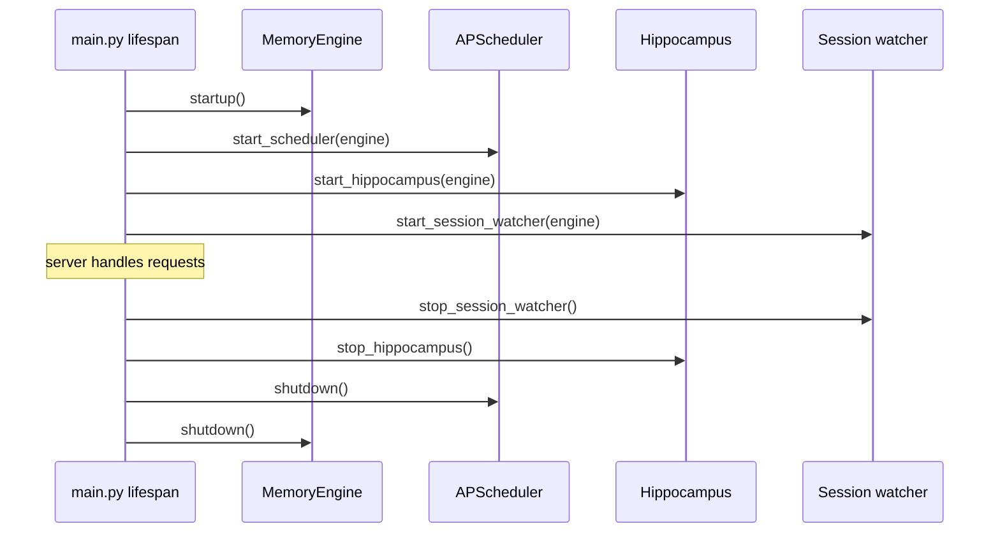
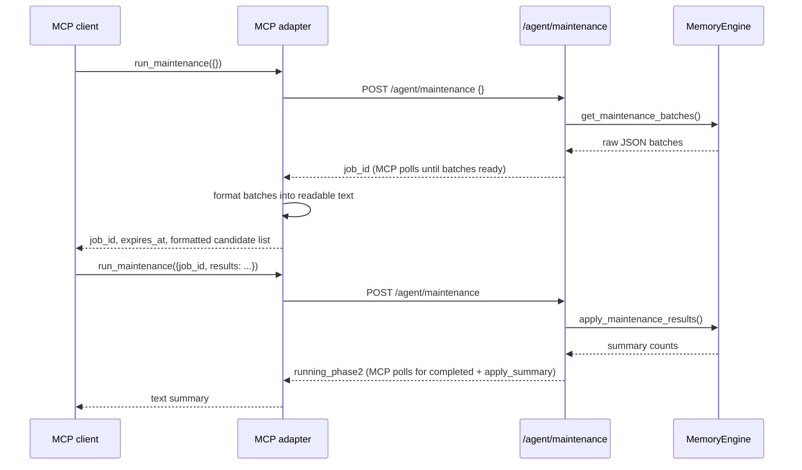

# API Surface

Verified against the current repository state on 2026-04-07.

The Ormah server is a FastAPI app on `localhost:8787`. Routes are grouped into `/agent`, `/admin`, `/ingest`, and `/ui`.

These routes are client-agnostic HTTP surfaces. Claude Code and Codex both call into the same backend API, and other clients can do the same.

## Application Lifecycle



Important nuance:

- hippocampus startup returns no observers unless it is enabled **and** watch dirs are configured
- session watcher startup returns no observers unless it is enabled

## Middleware

`src/ormah/api/middleware.py` adds agent-id extraction and request logging. CORS is restricted to loopback browser origins such as `localhost`, `127.0.0.1`, and `[::1]`.

## Agent Routes

**Code**: `src/ormah/api/routes_agent.py`

### Text-style routes

These return a JSON envelope shaped like:

```json
{"text": "...", "node_id": "...optional..."}
```

Routes in this group include:

- `POST /agent/remember`
- `POST /agent/recall`
- `GET /agent/recall/{node_id}`
- `POST /agent/update/{node_id}`
- `DELETE /agent/recall/{node_id}`
- `POST /agent/connect`
- `POST /agent/whisper`
- `POST /agent/feedback`
- `POST /agent/outdated/{node_id}`
- `POST /agent/merges/{merge_id}/undo`

### Structured JSON routes

These do **not** return the formatted text envelope:

- `GET /agent/insights`
- `GET /agent/proposals`
- `POST /agent/proposals/{proposal_id}`
- `POST /agent/maintenance`
- `GET /agent/merges`
- `GET /agent/audit`

So the old blanket statement "agent routes return formatted text, not raw JSON" is too broad.

## Whisper Endpoint

`POST /agent/whisper` expects a JSON body with:

- `prompt`
- optional `space`
- optional `session_id`

The route also maintains an in-memory recent-prompt buffer by session id before delegating to `MemoryEngine.get_whisper_context()`.

## Maintenance Endpoint

`POST /agent/maintenance` uses one in-memory expiring reservation.

### Phase 1

Send `{}`. An atomic claim returns HTTP 202 with `job_id` and
`status: "running_phase1"`. Preparation runs in a background thread. A competing
claim receives HTTP 200 with `status: "busy"` and a stop message, without the active
receipt or batches. Poll `GET /agent/maintenance?job_id=<receipt>` (receipt required),
or POST `{"job_id": "<receipt>"}`, until `awaiting_results` returns `batches` and UTC
`expires_at`. The batches contain `link_candidates`, `conflict_candidates`,
`merge_candidates`, `consolidation_clusters`, and `summary`.

Only analysis expires: its monotonic deadline starts when preparation finishes,
30 minutes by default (`ORMAH_MAINTENANCE_TIMEOUT_MINUTES`, positive integer).
Repeated status reads do not renew it. Expiry is checked on claim, submit, status,
and maintenance eligibility. Preparation and application remain reserved.

### Phase 2

Send `{"job_id": "<receipt>", "results": {...}}` (including `results: {}` when empty).
The matching unexpired assignment transitions atomically to `running_phase2` and
returns HTTP 202. Poll the receipt until `completed` with `apply_summary`. Only
successful application records `last_maintenance_run` and releases the reservation.
The MCP adapter presents completion as `{"status": "applied", "job_id": "...",
"summary": {...}}`; the HTTP route returns the job state.

Missing/wrong/expired receipts and duplicate submissions return HTTP 409; a lost
assignment after restart returns HTTP 404. No rejected submission applies results.
A duplicate while applying must poll its receipt instead of submitting again.
Polling yields terminal `expired`, `replaced`, `failed`, or `idle` for unusable
assignments: discard stale analysis and stop that run. Never relabel old decisions
with a newer receipt. No session ID fallback is supported.

The whisper signal remains interval-based and is suppressed while any reservation
is active. Expiry/failure restores eligibility without recording completion. Admin
`/admin/maintenance-status` and health diagnostics retain current job metadata.
Reservations are in memory; restart loses them and old receipts fail safely.

## Admin Routes

**Code**: `src/ormah/api/routes_admin.py`

Available routes:

- `GET /admin/health`
- `GET /admin/stats`
- `POST /admin/rebuild`
- `GET /admin/tasks`
- `POST /admin/tasks/{task_id}/run`
- `POST /admin/tasks/run-all`
- `POST /admin/tasks/{task_id}/pause`
- `POST /admin/tasks/{task_id}/resume`
- `POST /admin/tasks/pause-all`
- `POST /admin/tasks/resume-all`

### Sleep-cycle order

`run-all` executes tasks in this order:

```text
importance_scorer
-> index_updater
-> duplicate_merger
-> conflict_detector
-> auto_linker
-> auto_cluster
-> consolidator
-> decay_manager
```

`index_updater` is part of the run-all path even though it is not a standalone imported background module in `_TASK_RUNNERS`.

## Account Billing Routes

**Code**: `src/ormah/api/routes_account.py`

These loopback routes are thin adapters over the authenticated Ormah Cloud client:

- `GET /admin/account/offer`
- `POST /admin/account/checkout`
- `POST /admin/account/portal`

They require a locally configured Ormah account token. Checkout accepts only a canonical
`protection_intent_id` UUIDv4; callers cannot supply an email, Stripe customer, price, or return
URL. Offer responses contain only `name`, `unit_amount`, `currency`, `interval`, and
`interval_count`. Checkout and Portal return a short-lived, purpose-specific `url`; the cloud
client accepts only exact `checkout.stripe.com` or `billing.stripe.com` HTTPS hosts with no
embedded credentials.

The routes never run backup or verification work and never return account tokens or Stripe
provider identifiers. Stripe webhooks and reconciliation remain authoritative for entitlement;
receiving a Checkout URL does not activate cloud backup.

## Ingest Routes

**Code**: `src/ormah/api/routes_ingest.py`

Routes:

- `POST /ingest/conversation`
- `POST /ingest/file`

These are used by bulk ingestion, whisper-out, hippocampus, and the session watcher.

## UI Routes

**Code**: `src/ormah/api/routes_ui.py`

Routes:

- `GET /ui/graph`
- `GET /ui/graph/node/{node_id}`
- `GET /ui/search`
- `GET /ui/insights`
- `WS /ui/ws` placeholder

### `GET /ui/graph` response shape

```json
{
  "nodes": [{"id": "...", "type": "fact", "title": "..."}],
  "edges": [
    {
      "source_id": "...",
      "target_id": "...",
      "edge_type": "related_to",
      "weight": 0.7,
      "created": "..."
    }
  ],
  "user_node_id": "..."
}
```

The edge keys are `source_id`, `target_id`, and `edge_type`, not `source`, `target`, and `type`.

## Response Format Summary

| Route family | Typical shape |
|---|---|
| Most `/agent` write/read routes | `{text, node_id?}` |
| `/agent/maintenance`, `/agent/proposals`, `/agent/insights`, `/agent/merges`, `/agent/audit` | structured JSON |
| `/admin/*` | structured JSON |
| `/ui/*` | structured JSON |

## Walkthrough: maintenance via MCP



## Code Anchors

- `src/ormah/main.py`
- `src/ormah/api/routes_agent.py`
- `src/ormah/api/routes_admin.py`
- `src/ormah/api/routes_ingest.py`
- `src/ormah/api/routes_ui.py`
