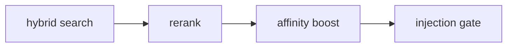

# Affinity and Feedback

Verified against the current repository state on 2026-06-13.

Affinity is Ormah's feedback-based score adjustment layer for whisper. It learns whether a memory tends to be useful in prompts similar to the current one.

## How Feedback Enters the System

Affinity learning is driven by trusted feedback about previously surfaced memories. Feedback
can arrive through `submit_feedback(...)` or from automatic session-watcher signal mining.

In this system:

- `explicit` feedback means a direct judgment is submitted because the user or agent intentionally marks a memory as useful or not useful
- `implicit` feedback means the client or agent infers usefulness from the interaction and submits that judgment without the user explicitly rating it

In both explicit and implicit `submit_feedback(...)` cases, Ormah learns through the same
turn-level affinity table; the difference is where the judgment came from, not how it is
applied.

Ormah does not infer negative feedback from silence alone. Session-watcher heuristics may
record neutral `whisper_unreferenced` signals for observability, but only clear positive
references are promoted into affinity rows. If `feedback_llm_judge_enabled` is on and an
LLM provider is configured, the session watcher can ask the LLM to judge ambiguous turns;
only confident `used` / `irrelevant` verdicts are promoted into positive / negative
affinity.

## Where Feedback Comes From

**Code**: `src/ormah/engine/memory_engine.py:submit_feedback()`

Feedback is learned from previously logged whisper candidates, not from arbitrary node ids in isolation.

When feedback is submitted:

1. Ormah resolves the node id against `whisper_log`
2. it looks up the latest logged prompt vector for that node
3. it inserts an `affinity` row using that stored prompt context
4. it records a corresponding `signals` ledger row
5. explicit feedback also marks relevant `review_log` entries as answered

Whispered short ids work here too: the resolver accepts full ids first, then falls back to a unique prefix match against `whisper_log`.

## How Candidates Get Populated

Affinity does **not** choose its own candidates. It learns from candidates that whisper already surfaced and logged.

### Step 1: whisper builds a candidate set

During whisper, Ormah:

1. retrieves candidates
2. reranks them
3. applies affinity boost
4. keeps `pre_gate_candidates` = candidates that survive the post-boost `0.40` floor

At this point, the set may contain:

- candidates that will actually be injected
- candidates that were strong enough to be considered, but later fail the injection gate

### Step 2: whisper writes those candidates to `whisper_log`

If `session_id` and `prompt_vec` exist, Ormah logs one `whisper_log` row per non-temporal candidate with boosted score `>= 0.40`.

Important details:

- it uses `pre_gate_candidates` when available, not only final injected results
- `was_injected = 1` means the candidate survived the final gate and was shown
- `was_injected = 0` means it was considered seriously enough to log, but was held back

So `whisper_log` is the staging table that says:

> "For this prompt/session, Ormah considered these memories, and here is whether each one was actually injected."

### Step 3: later feedback or usage detection converts logged candidates into signals

When `submit_feedback(node_id, ...)` is called, Ormah does **not** recompute prompt context. It looks up the most recent `whisper_log` entry for that node and copies:

- `prompt_vec`
- `prompt_text`
- `space`
- `session_id`
- `whisper_log_id`

into the `affinity` table along with the submitted `signal`. It also appends a
`feedback_submitted` row to `signals`.

When the transcript watcher processes a normalized transcript, it compares injected `whisper_log` rows
against the assistant response that followed the matching user prompt. Conservative local
heuristics record:

- `whisper_referenced` with polarity `+1` when the response clearly cites or reuses the memory
- `whisper_unreferenced` with polarity `0` when no clear reference is found

Only `whisper_referenced` heuristic signals are promoted to `affinity`; unreferenced signals
remain observational.

If the optional LLM judge is enabled, those ambiguous unreferenced rows are grouped by
prompt/response and sent to the configured LLM. The judge returns `used`, `irrelevant`, or
`uncertain` with confidence. Ormah records the judge output in `signals` and promotes only
high-confidence verdicts:

- `whisper_judged_used` with polarity `+1` becomes positive affinity
- `whisper_judged_irrelevant` with polarity `-1` becomes negative affinity
- `whisper_judged_uncertain` with polarity `0` remains observational

Low-confidence judge verdicts are normalized to `whisper_judged_uncertain` so they do not
change ranking.

That is why the system needs `whisper_log` first: affinity rows are learned from previously logged whisper candidates.

## Stored Fields

Current stored affinity rows include:

- `prompt_vec`
- `prompt_text`
- `node_id`
- `signal`
- `source`
- `confirmed_at`
- `space`
- `session_id`
- `whisper_log_id`

Current stored signal rows include:

- `whisper_log_id`
- `node_id`
- `signal_type`
- `polarity`
- `strength`
- `source`
- `session_id`
- `surface`
- `space`
- `prompt_hash`
- `evidence`
- `created`

## How Boost Is Computed

**Code**: `src/ormah/engine/affinity.py`

For each candidate node:

1. fetch all affinity rows for that node
2. deserialize each stored `prompt_vec`
3. compare the current prompt vector to the stored prompt vector
4. skip rows below `affinity_similarity_threshold`
5. apply recency decay using `affinity_half_life_days`
6. weight implicit rows by `affinity_implicit_weight`
7. average signed contributions
8. scale by `affinity_max_boost`

## Current Defaults

| Setting | Default |
|---|---:|
| `affinity_similarity_threshold` | `0.70` |
| `affinity_half_life_days` | `30.0` |
| `affinity_max_boost` | `0.15` |
| `affinity_implicit_weight` | `0.8` |
| `feedback_llm_judge_enabled` | `false` |
| `feedback_llm_judge_min_confidence` | `0.75` |

## Math

Conceptually:

```python
for row in affinity_rows:
    sim = cosine(current_prompt_vec, row.prompt_vec)
    if sim < threshold:
        continue

    recency = exp(-days_ago * ln(2) / half_life)
    source_weight = 1.0 if row.source == "explicit" else implicit_weight
    weight = sim * recency * source_weight

    weighted_sum += row.signal * weight
    weight_total += weight

boost = (weighted_sum / weight_total) * affinity_max_boost
```

## Where Affinity Fits in Whisper

Affinity is applied after retrieval and reranking, before the final injection decision.



It can rescue a borderline candidate or slightly suppress a noisy one, but it is capped.

## Review Loop

On the first message of a session, whisper may surface one held-back candidate as a review suggestion. That review block asks the client/agent to call `submit_feedback(...)` later if the relevance can be judged.

This remains one bridge between whisper behavior and future affinity learning. The transcript
watcher now provides a second bridge by mining completed transcripts for clear memory usage.

The review candidate is selected from recent `whisper_log` rows where:

- `was_injected = 0`
- the node has not also been injected recently
- there is no strong existing affinity signal for similar prompts
- it has not been surfaced for review too recently
- it is not already "exhausted" with too many unanswered review prompts

## Walkthrough Example

1. whisper surfaces a node during a prompt about database decisions
2. later, either the agent calls `submit_feedback(...)` or the transcript watcher sees the assistant clearly used that node
3. Ormah records a signal tied to the exact `whisper_log` row
4. trusted positive judgments create an affinity row tied to that same prompt vector
5. on a future prompt with similar wording, that node can receive a small positive score boost

With the optional LLM judge enabled, a clearly off-topic memory can instead receive a
trusted negative affinity row when the judge returns a confident `irrelevant` verdict.

## Code Anchors

- `src/ormah/engine/affinity.py`
- `src/ormah/engine/memory_engine.py`
- `src/ormah/index/schema.sql`
