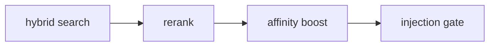

# Affinity and Feedback

Verified against the current repository state on 2026-04-07.

Affinity is Ormah's feedback-based score adjustment layer for whisper. It learns whether a memory tends to be useful in prompts similar to the current one.

## Important Behavioral Correction

The current system does **not** automatically infer feedback just because a whispered memory appeared or was ignored.

Affinity rows are created when `submit_feedback(...)` is called.

That means:

- explicit feedback: definitely supported
- implicit feedback: supported as a tool/API concept, but still must be submitted explicitly by the client / agent

## Where Feedback Comes From

**Code**: `src/ormah/engine/memory_engine.py:submit_feedback()`

When feedback is submitted:

1. Ormah resolves the node id against `whisper_log`
2. it looks up the latest logged prompt vector for that node
3. it inserts an `affinity` row using that stored prompt context
4. explicit feedback also marks relevant `review_log` entries as answered

## How Candidates Get Populated

This is the missing bridge in many mental models: affinity does **not** choose its own candidates. It learns from candidates that whisper already surfaced and logged.

### Step 1: whisper builds a candidate set

During whisper, Ormah:

1. retrieves candidates
2. reranks them
3. applies affinity boost
4. keeps `pre_gate_candidates` = candidates that survive the post-boost `0.40` floor

At this point, the set may contain:

- candidates that will actually be injected
- candidates that were strong enough to be considered, but later fail the injection gate

### Step 2: whisper writes those candidates to `whisper_log`

If `session_id` and `prompt_vec` exist, Ormah logs one `whisper_log` row per non-temporal candidate with boosted score `>= 0.40`.

Important details:

- it uses `pre_gate_candidates` when available, not only final injected results
- `was_injected = 1` means the candidate survived the final gate and was shown
- `was_injected = 0` means it was considered seriously enough to log, but was held back

So `whisper_log` is the staging table that says:

> "For this prompt/session, Ormah considered these memories, and here is whether each one was actually injected."

### Step 3: later feedback converts logged candidates into affinity rows

When `submit_feedback(node_id, ...)` is called, Ormah does **not** recompute prompt context. It looks up the most recent `whisper_log` entry for that node and copies:

- `prompt_vec`
- `prompt_text`
- `space`
- `session_id`

into the `affinity` table along with the submitted `signal`.

That is why the system needs `whisper_log` first: affinity rows are learned from previously logged whisper candidates.

## Stored Fields

Current stored affinity rows include:

- `prompt_vec`
- `prompt_text`
- `node_id`
- `signal`
- `source`
- `confirmed_at`
- `space`
- `session_id`

Older notes that mention `prompt_embedding` and `created` are stale field names.

## How Boost Is Computed

**Code**: `src/ormah/engine/affinity.py`

For each candidate node:

1. fetch all affinity rows for that node
2. deserialize each stored `prompt_vec`
3. compare the current prompt vector to the stored prompt vector
4. skip rows below `affinity_similarity_threshold`
5. apply recency decay using `affinity_half_life_days`
6. weight implicit rows by `affinity_implicit_weight`
7. average signed contributions
8. scale by `affinity_max_boost`

## Current Defaults

| Setting | Default |
|---|---:|
| `affinity_similarity_threshold` | `0.70` |
| `affinity_half_life_days` | `30.0` |
| `affinity_max_boost` | `0.15` |
| `affinity_implicit_weight` | `0.8` |

The `0.8` implicit weight is a meaningful correction from older docs that described it as `0.3`.

## Math

Conceptually:

```python
for row in affinity_rows:
    sim = cosine(current_prompt_vec, row.prompt_vec)
    if sim < threshold:
        continue

    recency = exp(-days_ago * ln(2) / half_life)
    source_weight = implicit_weight if row.source == "implicit" else 1.0
    weight = sim * recency * source_weight

    weighted_sum += row.signal * weight
    weight_total += weight

boost = (weighted_sum / weight_total) * affinity_max_boost
```

## Where Affinity Fits in Whisper

Affinity is applied after retrieval and reranking, before the final injection decision.



It can rescue a borderline candidate or slightly suppress a noisy one, but it is capped.

## Review Loop

On the first message of a session, whisper may surface one held-back candidate as a review suggestion. That review block asks the client/agent to call `submit_feedback(...)` later if the relevance can be judged.

This is the current bridge between whisper behavior and future affinity learning.

The review candidate is selected from recent `whisper_log` rows where:

- `was_injected = 0`
- the node has not also been injected recently
- there is no strong existing affinity signal for similar prompts
- it has not been surfaced for review too recently
- it is not already "exhausted" with too many unanswered review prompts

## Walkthrough Example

1. whisper surfaces a node during a prompt about database decisions
2. later, the agent calls `submit_feedback(node_id=..., signal=1, source="implicit")`
3. Ormah records an affinity row tied to the prompt vector from `whisper_log`
4. on a future prompt with similar wording, that node can receive a small positive score boost

## Code Anchors

- `src/ormah/engine/affinity.py`
- `src/ormah/engine/memory_engine.py`
- `src/ormah/index/schema.sql`
