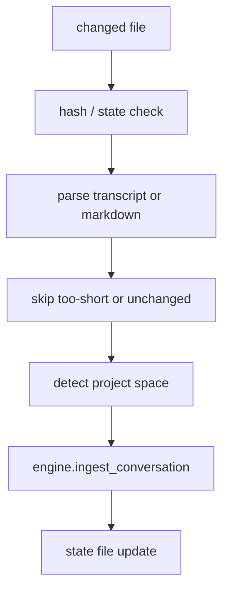

# Hippocampus and Session Watcher

Verified against the current repository state on 2026-04-13.

These are two separate watcher systems:

- **Hippocampus** watches configured markdown directories and ingests changed files
- **Session watcher** watches agent transcript directories and ingests completed sessions

They are separate from the node-store watcher in `src/ormah/store/watcher.py`, which is not started by the app runtime.

## Hippocampus

**Code**: `src/ormah/background/hippocampus.py`

Hippocampus watches configured external markdown directories, not Ormah's own node directory.

### Startup conditions

Hippocampus only starts when both are true:

- `hippocampus_enabled == True`
- `hippocampus_watch_dirs` is non-empty

Current default:

- `hippocampus_enabled = True`
- `hippocampus_watch_dirs = []`

So the effective out-of-the-box behavior is "enabled in principle, but inactive until watch dirs are configured".

### What it does

1. performs a catch-up scan of each watch dir
2. computes hashes to skip unchanged files
3. filters ignored paths
4. detects space from repo / directory context
5. calls `engine.ingest_conversation(...)`
6. persists a `.hippocampus_state` file per watch dir
7. starts real-time watchdog observers

Ignored-path filtering is configurable through `hippocampus_ignore_patterns`.

## Session Watcher

**Code**: `src/ormah/background/session_watcher.py`

The session watcher ingests normalized agent transcript JSONL files.

### Startup conditions

It only starts when:

- `session_watcher_enabled == True`
- the configured watch dir exists

Current defaults:

- `session_watcher_enabled = False`
- `session_watcher_dir = ~/.claude/projects`
- `session_watcher_debounce_seconds = 60`
- `session_watcher_min_turns = 5`
- `session_watcher_lookback_hours = 72`
- `feedback_llm_judge_enabled = false`
- `feedback_llm_judge_min_confidence = 0.75`

The current default watch directory remains the historical Claude Code path for compatibility.
The parser and downstream ingestion path are agent-normalized; adding another client should
mean adding a transcript source/adapter, not changing memory ingestion or signal mining.

### What it does

1. scans for changed `.jsonl` files
2. applies first-run lookback filtering
3. normalizes transcripts into source metadata, turns, and conversation text
4. skips very short sessions
5. derives space from the current source's strategy
6. ingests the conversation through `engine.ingest_conversation(...)`
7. stores `.session_watcher_state`
8. starts a real-time observer

During transcript processing, the watcher also mines injected whisper rows for feedback
signals. The free/local heuristic path records clear references as positive signals and
non-references as neutral observations. If `feedback_llm_judge_enabled` is true and
`llm_provider` is not `none`, ambiguous rows are sent to the configured LLM for a
`used` / `irrelevant` / `uncertain` verdict. Only confident `used` and `irrelevant`
verdicts affect affinity.

## Transcript Parser

**Code**: `src/ormah/transcript/parser.py`

The parser normalizes supported agent transcript formats into a shared result:

```python
TranscriptResult(
    session_id="...",
    source="claude_code" | "codex" | "agent_jsonl",
    turns=[TranscriptTurn(role="user", text="..."), ...],
    conversation="User: ...\n\nAssistant: ...",
)
```

That normalized boundary is what ingestion and signal mining consume. Agent-specific code
should stay at the discovery/parsing edge.

Supported normalized sources:

- Claude Code entries with `type: "user"` / `type: "assistant"`
- Codex-style `response_item` message entries

It extracts:

- user text blocks
- assistant text blocks

And skips:

- tool-only blocks
- tool results
- non-message payloads
- bootstrap/environment context

## Flow



## Example Walkthrough

Session watcher example:

1. a new session file appears under `~/.claude/projects/-Users-username-Personal-ormah/...jsonl`
2. watcher debounces changes
3. parser extracts cleaned conversation text
4. parent directory name is decoded and the last path segment becomes `ormah`
5. Ormah ingests the conversation as candidate memories
6. state is updated so the same file is not reprocessed unnecessarily

For future agents, add a source adapter that finds transcript files, assigns source metadata,
and provides a space strategy. The rest of the pipeline should continue to consume
`TranscriptResult`.

## Code Anchors

- `src/ormah/background/hippocampus.py`
- `src/ormah/background/session_watcher.py`
- `src/ormah/transcript/parser.py`
