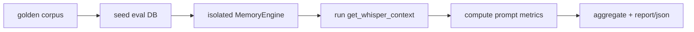

# Eval Framework

Verified against the current repository state on 2026-08-12.

Ormah includes an in-repo eval harness for the whisper system under `eval/whisper/`.

## Purpose

The whisper eval answers two questions:

1. are the right memories injected?
2. are irrelevant memories suppressed?

## Architecture

Current eval flow is in-process, not server-HTTP based.



## Main Components

- `corpus/` - test definitions
- `seeder.py` - seeds an isolated eval memory graph
- `runner.py` - runs prompt cases against `engine.get_whisper_context(..., _return_debug=True)`
- `metrics.py` - computes precision/recall style metrics
- `report.py` - renders text reports
- `cli.py` - CLI entry

## Important Correction

The current eval runner does not need a running Ormah HTTP server for its main path. It creates an isolated engine and invokes whisper directly in-process.

Older docs describing the runner as `POST /agent/whisper` for each case are stale.

## CLI

```bash
ormah eval whisper run
ormah eval whisper run --category preference
ormah eval whisper run --show-failures
ormah eval whisper run --simulate-session
ormah eval whisper run --preserve-self
ormah eval whisper run --json
```

## Metric contracts

Legacy local corpora retain their original macro-averaged metrics and report so
the existing July baseline and `make eval` thresholds do not silently change.

New schema-v2 corpora use explicit inject/abstain/ask-qualify decisions and report:

- micro node injection precision and recall;
- inject-required turns receiving all critical nodes (`useful_recall`);
- abstain-turn false-positive rate;
- forbidden-node suppression accuracy;
- strict exact-label turn precision as an offline proxy;
- explicit unavailable metrics rather than inferred usage, delivery, or downstream lift.

The full product `turn_precision` remains unavailable until material helpfulness
is actually judged. Reported Wilson intervals are descriptive and assume
independent observations; correlated replay/session release evidence still needs
a cluster-aware method. `--fail-below` checks point estimates for regression and
does not constitute the C08 release gate.

## Corpus and provenance

Schema-v2 files require stable case and prompt IDs, consistent dataset version and
partition, explicit eligible/required/acceptable/forbidden nodes, a rationale,
slice labels, and asserted adjudication status. Drafts do not bind unless
`--include-provisional` is explicitly used for a smoke run.

Private holdouts are aggregate-only: the CLI refuses category filtering,
`--show-failures`, and provisional execution for a holdout partition. Run metadata
hashes both source and effective selected corpus input and records settings,
runtime versions, code revision, dirty state, and reranker availability. This is
diagnostic provenance, not a release reproducibility claim, because model artifact
revisions and cluster-aware uncertainty are not frozen yet.

## Historical legacy snapshot

The private legacy corpus has changed over time, so historical values must be
compared only under the legacy contract. The corpus README records dated snapshots.
For example, the 2026-07-03 100-prompt run reported overall F1 0.69 and silence
accuracy 0.95. These values are not comparable to schema-v2 metrics.

The tracked `public/contract-smoke-v2.jsonl` fixture validates the schema and
end-to-end harness only. Its two synthetic prompts are not a product benchmark.

## Session Simulation

The runner can simulate multi-turn whisper behavior by maintaining `recent_prompts` and `session_id`, mirroring the logic used by `/agent/whisper`.

That makes it useful for:

- continuation prompts
- session-aware search-query enhancement
- first-turn vs follow-up behavior

## Walkthrough Example

For a case about the whisper eval pipeline:

1. seed the case-specific memories into the isolated eval DB
2. call `engine.get_whisper_context(..., _return_debug=True)`
3. capture returned injected node ids
4. compare them against either the legacy labels or schema-v2 decision unit:
   - `should_inject`
   - `should_not_inject`
   - silence/suppression expectations
   - target decision, eligibility, rationale, slice, and adjudication metadata
5. aggregate those prompt-level results across the corpus

## Code Anchors

- `eval/whisper/cli.py`
- `eval/whisper/runner.py`
- `eval/whisper/metrics.py`
- `eval/whisper/seeder.py`
