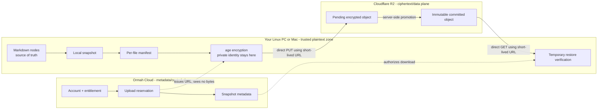
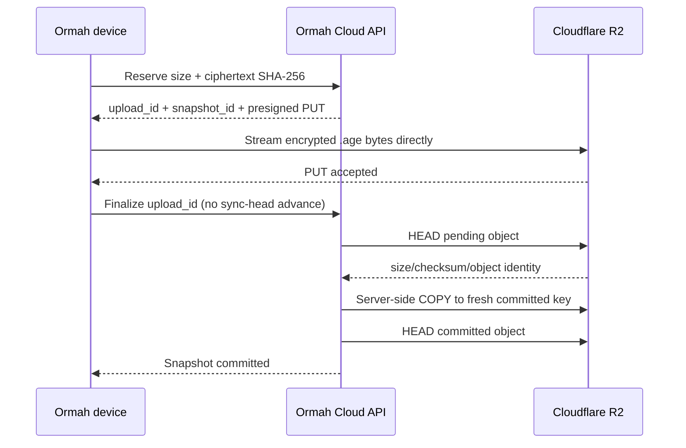
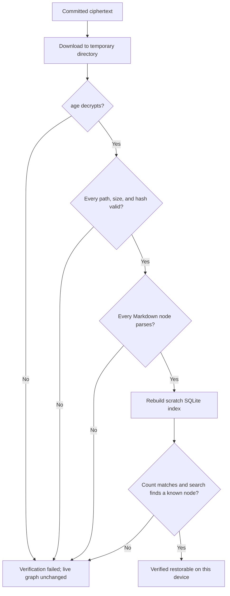

# Cloud Backup, Verification, and Restore

Verified against the current Ormah client and the hardened C01 cloud protocol on 2026-07-31.

This guide explains what happens when Ormah protects a memory graph in the cloud. It starts with a
small worked example, then adds the security and failure-handling details one layer at a time.

The central idea is:

> Ormah Cloud stores a locked package that only the user's devices can open. Upload success says the
> package arrived. Restore verification proves that the package can become a working memory graph.

## The 30-second mental model

Imagine moving a handwritten research notebook into a guarded warehouse:

1. **Photocopy the notebook.** Ormah makes a consistent local backup of the Markdown source files.
2. **Add a packing list.** Every file's size and SHA-256 fingerprint goes into a manifest.
3. **Lock the suitcase at home.** The client encrypts the complete package with the user's age key.
4. **Get a temporary loading pass.** Ormah Cloud issues a presigned URL for one pending R2 object.
5. **Deliver directly to the warehouse.** The client sends ciphertext straight to R2. It does not
   pass through the Ormah Cloud application.
6. **Move it into the locked archive.** The service verifies the pending object's size/checksum and
   promotes it to an immutable committed key.
7. **Rehearse the rescue.** Ormah later downloads the package into a temporary directory, decrypts
   it, verifies every file, rebuilds a scratch index, and proves search can find a known memory.

The warehouse knows which shelf holds the suitcase and how large it is. It cannot open the suitcase.

## One picture of the trust boundary



There are two planes:

- The **control plane** authenticates the account, checks entitlement, reserves uploads, records
  metadata, applies retention, and issues temporary storage permissions.
- The **data plane** carries the encrypted `.age` object directly between the device and R2.

Keeping these planes separate is how the service avoids receiving plaintext, encryption keys, or
blob bytes.

## Vocabulary before the worked example

| Term | Plain meaning |
| --- | --- |
| Memory store | One local Ormah graph, identified by a UUIDv4 `store_id` |
| Local backup | A timestamped copy of `nodes/` and `deleted/`, plus the active Self pointer |
| Bundle | A gzip-compressed tar archive containing the backup and integrity manifest |
| Ciphertext | The encrypted bytes produced by age; unreadable without an identity |
| Snapshot | One committed encrypted cloud recovery point, identified by a server ULID |
| Presigned URL | A short-lived permission to perform one storage operation on one object key |
| Commit/finalize | Verification and immutable promotion of a pending upload |
| Restore verification | A disposable rehearsal that proves a cloud snapshot can become a searchable graph |
| Recovery kit | The store ID plus every age secret identity needed to decrypt old and new snapshots |
| Sync head | The selected cross-machine sync version; ordinary cloud backups never move it |

## Worked example: three memories from PC to cloud

Suppose Rishi's home PC has this memory store:

```text
~/.local/share/ormah/memory/
|-- .store_id
|-- nodes/
|   |-- alice-preference.md
|   `-- ormah-release.md
|-- deleted/
|   `-- old-test-note.md
`-- index.db
```

For the example:

```text
store_id   = 7d326c73-1762-4fb7-8393-09af63a85d13
active     = 2 Markdown nodes
deleted    = 1 tombstone node
index.db   = derived search state
```

The real graph can have thousands of nodes. Three keeps the mechanics visible.

### Step 1: decide whether a cloud backup should run

The scheduled job checks these guards in order:

1. `cloud_backup_enabled` is true.
2. A cloud encryption key exists.
3. This memory directory already has a valid `.store_id`.
4. The cached/refreshed entitlement is `active` or `grace`.
5. The graph has a real node or deleted node to protect. A lone generated self node is not enough.
6. The previous successful upload is at least `cloud_backup_interval_hours` old, which defaults to
   24 hours.

If any guard fails, cloud backup stops safely. Local memory and ordinary local backups continue to
work. The cloud scheduler boundary records/logs failures and does not crash the Ormah server.

### Step 2: freeze the source-of-truth files

Ormah asks `BackupService` for a current local snapshot. It reuses the latest backup only if its
active and deleted Markdown files exactly match the live graph by filename, size, and SHA-256.
Otherwise it creates a new backup such as:

```text
~/.local/share/ormah/backups/memory_2026-07-27_17-04-44/
|-- nodes/
|   |-- alice-preference.md
|   `-- ormah-release.md
|-- deleted/
|   `-- old-test-note.md
`-- backup.json
```

`backup.json` records when and why the local backup was made and the exact `user_node_id` selected as
the graph's active Self. That small pointer is portable source state even though the rest of SQLite is
derived. It prevents a fresh installation's temporary Self node from remaining active after a full
restore. Historical duplicate Self nodes are copied like every other node; backup and restore do not
merge or repair them.

The snapshot deliberately excludes:

- `index.db`, its WAL, and other derived indexes;
- account tokens, `.env`, and API keys;
- logs and model caches;
- `.store_id`, which is carried separately in the encrypted bundle manifest/recovery kit.

Why exclude `index.db`? Markdown is the durable truth. An index can contain stale or
platform-specific derived state, so restore rebuilds it from the Markdown instead of trusting it.

### Step 3: build an integrity manifest

Before encryption, Ormah reads each included file and creates `bundle-manifest.json`. A simplified
illustration looks like this:

```json
{
  "format_version": 1,
  "store_id": "7d326c73-1762-4fb7-8393-09af63a85d13",
  "reason": "cloud-backup",
  "node_count": 2,
  "deleted_count": 1,
  "files": [
    {
      "path": "nodes/alice-preference.md",
      "size": 420,
      "sha256": "a981...b230"
    },
    {
      "path": "nodes/ormah-release.md",
      "size": 610,
      "sha256": "47b2...90cc"
    },
    {
      "path": "deleted/old-test-note.md",
      "size": 250,
      "sha256": "813f...ae11"
    },
    {
      "path": "backup.json",
      "size": 300,
      "sha256": "fd04...72a8"
    }
  ],
  "sync": {
    "base_snapshot_id": null,
    "device_id": null
  }
}
```

The hashes above are abbreviated teaching values. Real SHA-256 values have 64 hexadecimal
characters.

Think of each hash as a tamper-evident fingerprint. During restore, if one byte of
`alice-preference.md` differs, its computed fingerprint will not match the manifest.

### Step 4: compress, then encrypt locally

Ormah creates:

```text
age_encrypt(
    gzip_tar(
        nodes/*.md,
        deleted/*.md,
        backup.json,
        bundle-manifest.json
    )
)
```

Only the resulting ciphertext is eligible to leave the device.

Age uses the current public recipient to encrypt. Opening the bundle requires one of the matching
private identities stored in `~/.config/ormah/cloud.key`. The service never receives either the
private identity or plaintext archive.

Important consequence: the manifest itself is encrypted. R2 and Ormah Cloud cannot read node names,
titles, content, tags, links, counts from the manifest, or deletion contents. The service may store
separate operational metadata such as ciphertext size and snapshot timestamps, but not the hidden
manifest.

### Step 5: reserve an upload

Before writing, the client reads `/protocol` and requires protocol v2 plus the
`immutable-promotion` capability. If the service cannot prove that hardened write behavior, the
client fails closed and uploads nothing.

The client computes the encrypted file's size and SHA-256, then asks:

```http
POST /stores/7d326c73-1762-4fb7-8393-09af63a85d13/uploads
Authorization: Bearer <device token>

{
  "size_bytes": 1840,
  "sha256": "9fd0...12ab"
}
```

The service:

1. authenticates the account;
2. confirms upload entitlement;
3. confirms store ownership and quota including pending reservations;
4. generates an `upload_id` and sortable `snapshot_id`;
5. derives the R2 key from authenticated server records, never from a client-supplied object path;
6. returns a short-lived presigned PUT URL and the exact allowlisted headers the client must send.

Illustrative IDs:

```text
upload_id   = 0eaa145b-2d31-4b27-90d2-e41f8b625294
snapshot_id = 01K18M2YHM6GXQWQ90D2Q9BFY8
pending key = u/<account>/pending/0eaa145b-...5294.age
```

### What exactly is a presigned URL?

A normal R2 credential is like a warehouse master key: it can access many objects. Ormah must never
put that credential on a user's machine.

A presigned URL is like a temporary loading pass stamped with:

```text
operation: PUT
object:    this one pending key
expires:   within 15 minutes
signature: created using the service's storage credential
```

R2 verifies the signature when the device uses the URL. The device gains no general R2 credential,
cannot choose another key through that signature, and cannot keep using it after expiry.

Presigning also removes the service from the blob path:



The API handles small JSON metadata messages. R2 handles the encrypted bytes.

### Step 6: stream the ciphertext directly to R2

The client opens the `.age` file and streams it to the presigned URL. It accepts only these
service-required upload headers:

- `content-length`
- `content-type`
- `x-amz-checksum-sha256`

Unexpected headers or newline injection are rejected. The signed URL is not persisted or logged.

At this point the bytes exist only in the **pending** namespace. An interrupted or abandoned pending
upload is not a recovery point and is later cleaned by the janitor.

### Step 7: finalize and make the snapshot immutable

The client asks the service to finalize the reservation. For a backup, it deliberately sends no
`advance_head` request because backup history must not change the sync head.

The hardened service then:

1. leases the pending promotion so retries/races remain idempotent;
2. HEADs the pending object and checks its expected size/checksum/object identity;
3. copies it server-side into a fresh committed key;
4. verifies the destination;
5. commits the blob metadata transaction;
6. lets janitor remove the disposable pending object.

The committed key is shaped like:

```text
u/<account_id>/stores/<store_id>/snapshots/<snapshot_id>.age
```

Why promote instead of uploading directly there? A presigned PUT can remain valid for a few minutes
after the first use. If it pointed at the final key, reusing it could replace a recovery point that
the database already called committed. Promotion makes the old URL point only to disposable pending
space. No client PUT route exists for the committed prefix.

In the suitcase analogy, the loading pass reaches the receiving bay, never the permanent vault.

### Step 8: record local health

After finalization succeeds, the client records per-store state in:

```text
~/.local/share/ormah/cloud/<store_id>.json
```

For this example it records the successful upload time, snapshot ID, and clears the previous upload
error. State is keyed by `store_id`, so two different `ORMAH_MEMORY_DIR` values do not share backup
health accidentally.

The same file contains a two-phase upload journal:

- `reserved` means the PUT has not crossed the ambiguous commit boundary and can be replaced after
  interruption;
- `finalizing` means the service may have committed the object even if the client did not receive
  the response, so the client retries the same `upload_id` and never creates a second reservation;
- a finalizing upload is abandoned only when the service returns its structured `upload_expired`
  response and the locally recorded reservation lease has also expired.

Writers serialize this state with the store lock and replace the JSON atomically. Schema version 3
is deliberately fail-closed: an older client that encounters a newer state schema asks the user to
update Ormah instead of rewriting fields it does not understand. Rolling the binary back therefore
does not imply that protection state can safely be rolled back.

Protection status distinguishes a proven recovery point from a newly uploaded one. A successful
upload moves the store to `verification_pending` until that exact snapshot passes the restore
rehearsal. An older verified snapshot still remains downloadable, but the UI must not describe the
newest snapshot as protected yet. `finalizing` is different: its commit result is unknown, so status
becomes `attention_required` until the same upload ID is reconciled.

Upload success now proves:

- an encrypted object was committed;
- its transport size/checksum matched the reservation;
- the committed object cannot be rewritten through the pending URL.

It does **not yet prove** that the package decrypts into parseable, searchable memories. That is the
next job.

## Why restore verification is the special part

Many backup systems stop at “upload completed.” That proves delivery, not recovery.

An everyday analogy: seeing a parachute packed into a bag is not the same as testing that a packed
parachute opens. Ormah's restore verification is a controlled rehearsal that does not touch the live
graph.

The background scheduler runs this rehearsal weekly (`168` hours). C02's planned **Protect this
memory** experience will also run it immediately after the first upload before claiming protection.

For the latest committed snapshot, the current verification path:

1. asks the service to list committed snapshots;
2. rejects an object larger than the client's advertised safe processing limit;
3. requires the SHA-256 that the service verified during immutable promotion;
4. requests a presigned GET URL;
5. streams the ciphertext into a newly created temporary directory;
6. recomputes the ciphertext SHA-256 and compares it with the committed metadata;
7. decrypts it using all retained local age identities;
8. accepts only regular allowlisted paths: `nodes/*.md`, `deleted/*.md`, `backup.json`, and
   `bundle-manifest.json`;
9. rejects absolute paths, `..`, backslashes, links, duplicates, Unicode/case collisions, excess
   members, and excess expanded bytes;
10. recomputes every file size and SHA-256 and compares them with the encrypted manifest;
11. validates that `backup.json`'s active Self pointer names the exact included `system:self` node;
12. parses every active and deleted Markdown node;
13. creates a throwaway SQLite database and rebuilds its index from the extracted active nodes;
14. requires the rebuilt active-node count to equal `manifest.node_count`;
15. runs an FTS search and requires it to return a known restored node;
16. records `last_verify_ok=true` and the exact snapshot ID;
17. deletes the temporary directory in `finally`, whether verification succeeds or fails.

Those checks are reported as seven stable proof stages: download, ciphertext hash, decryption,
manifest/file hashes, Markdown parsing, scratch-index rebuild, and search probe. Error messages are
privacy-safe: they can identify the failed stage but never persist a node filename or malformed
frontmatter content.

The blob-list wire contract always includes `sha256`: a lowercase 64-character value for a
service-verified ciphertext, or JSON `null` for an older blob whose checksum was never attested. A
missing key identifies an older service deployment, not an unverified blob, and verification asks
for the service to be updated rather than guessing.

For our three-file example, the scratch index must rebuild exactly `2` active nodes. The deleted
node is parsed and integrity-checked but correctly does not become an active search result.



“Verified restorable” is device-specific evidence. The server cannot assert it by inspecting the
blob because the server cannot decrypt it. The client that performed the rehearsal records the
proof locally.

## What each party can and cannot see

| Party | Can see | Cannot see |
| --- | --- | --- |
| Your device | Markdown, manifest, keys, ciphertext, restored graph | Nothing needed for its own operation |
| Ormah Cloud | Account/auth metadata, entitlement, store/snapshot IDs, ciphertext size/hash, timestamps, object keys | Node text, titles, tags, edges, manifest contents, age private identities, recovery kit, card number |
| Cloudflare R2 | Object keys, encrypted bytes, sizes, storage access timing | Decrypted graph, age private identities |
| Stripe | Customer and subscription/payment information | Memory graph, ciphertext, encryption keys |
| Resend | Destination email and OTP email delivery metadata | Memory graph, cloud keys, Stripe card data |

This is the practical zero-knowledge boundary. It protects confidentiality of memory content from
the hosted service. It does not mean the service knows literally nothing: accounts, billing,
storage sizes, timing, and opaque identifiers are necessary operational metadata.

## Worked restore: home PC to a fresh Mac

Now suppose the home PC is lost or unavailable and a fresh Mac has Ormah but no graph.

The user needs two independent capabilities:

1. **Account login** authorizes listing and downloading their retained cloud objects.
2. **Recovery kit** supplies the original `store_id` and private age identities needed to locate and
   decrypt those objects.

An account token without the recovery kit can fetch ciphertext but cannot read it. A recovery kit is
therefore extremely sensitive: anyone who obtains both the kit and a retained encrypted bundle can
decrypt that bundle.

Today's CLI flow is:

```bash
ormah account login
ormah cloud init --import-key /path/to/ormah-recovery-kit.md
ormah server stop
ormah backup restore --cloud --yes
```

Recovery-kit import is preflighted before either local resource changes. Ormah reads the kit once,
validates its store ID and every identity, then compares them with any installed `.store_id` and
`cloud.key`. The normal uninstall/reinstall state has a preserved matching key but no store ID; in
that case Ormah installs only the missing store ID, leaves the key file byte-for-byte unchanged,
regenerates the canonical recovery kit from the complete installed keyring, and exits successfully.
Repeating an already-complete import is also a successful no-op. A different store ID or an identity
that is not already present in an existing keyring fails before either resource is written.

Human and JSON output report the store and key outcomes independently. JSON callers receive
`store_id_status` and `key_status`; neither output includes private identity material. Existing
keyrings with additional retained rotation identities are valid, and the refreshed recovery kit
contains the full current-first keyring rather than preserving a stale or unrelated kit file.

The restore command:

1. reads the imported store ID instead of generating a new remote namespace;
2. lists committed snapshots and selects the requested ID or the latest committed backup;
3. requests a short-lived presigned GET URL;
4. downloads directly from R2;
5. decrypts and performs the same safe extraction and manifest hash verification;
6. installs the extracted snapshot as a normal local backup;
7. delegates to the existing `BackupService.restore()` path;
8. creates a safety backup of any current Mac memory before replacement;
9. replaces only the source-of-truth `nodes/` and `deleted/` directories;
10. rebuilds the Mac's SQLite search index from Markdown;
11. replaces the Mac-local active Self pointer with the source graph's recorded `user_node_id`.

For the example, the result is two active nodes, one deleted node retained as a tombstone, and a
fresh searchable index containing the two active nodes. If installing Ormah on the Mac created a
temporary isolated Self node before restore, the pre-restore safety backup preserves it and the full
restore then removes it with the rest of the target graph. The source graph's selected Self becomes
active exactly as backed up.

This is intentionally replacement, not merge. Restore does not inspect connections to decide which
Self node looks most important, transfer target-only nodes, or rewrite historical source duplicates.
Those are sync or explicit repair concerns. A new backup records the choice exactly. An older backup
without the pointer is accepted only when it contains zero or one `system:self` node; an ambiguous
legacy backup fails before touching the target and asks for a fresh backup from the source machine.

Cloud restore remains available when subscription entitlement expires, while the service retains
the snapshot. Cancellation pauses new uploads; it does not turn recovery into a ransom gate.

## What happens when something fails?

| Failure | Result |
| --- | --- |
| Offline before reservation | No upload; local memory and local backups remain usable |
| Entitlement expired | New cloud upload pauses; retained list/download/restore still work |
| Bundle exceeds safe client limit | Client refuses before upload or download processing |
| PUT fails or URL expires | Client does not finalize; pending reservation/object is cleaned later |
| Finalize sees wrong size/checksum | Snapshot is not committed |
| Client loses the finalize response | Durable journal retries the same upload ID; no duplicate is reserved |
| Process dies during promotion | Durable service lease/state lets janitor reconcile safely rather than guessing |
| Ciphertext is truncated or altered | Age decryption or archive/manifest verification fails |
| A Markdown file is malformed | Parse stage fails; snapshot is not marked verified |
| Active Self pointer is missing, invalid, or ambiguous | Verification/restore fails closed before replacing the live graph |
| Scratch index/search fails | Snapshot remains committed but is not reported as verified restorable |
| Verification fails | Live graph bytes and mtimes remain untouched; exact error is recorded locally |
| Restore starts on a populated machine | A safety backup is created before source directories are replaced |
| Recovery kit is lost with every device | Ormah Cloud cannot decrypt for the user; zero knowledge has no back door |

The last row is the fundamental tradeoff. A provider-accessible recovery key would make support
easier but would break the promise that the provider cannot decrypt the graph. Planned trusted-device
pairing improves the new-machine experience without giving the service the plaintext key.

## Backup, verification, restore, and sync are different

| Operation | Purpose | Changes live graph? | Moves sync head? |
| --- | --- | --- | --- |
| Local backup | Nearby rollback copy | No | No |
| Cloud backup | Durable encrypted recovery point | No | No |
| Restore verification | Prove recovery in scratch space | No | No |
| Cloud restore | Replace local source files after confirmation/safety backup | Yes | No |
| Sync | Converge changes between machines | Eventually, after merge/publication | Yes, using CAS |

This separation is intentional. A scheduled backup must never silently publish itself as the latest
cross-machine truth. `CloudProtectionService.backup_now()` calls `finalize_upload()` without
`advance_head`, and the scheduler's `run_cloud_backup()` is now only a guarded adapter over that
shared service.

`CloudProtectionService` is the reusable Python owner of immediate backup and restore verification;
`cloud_status_payload()` is the single status derivation used by CLI, local REST, and UI consumers.
These entry points keep state transitions and failure recording out of presentation adapters. Direct
`backup_now()` means run now; only the scheduler passes `only_if_due=true`. Manual verification is
still permitted after protection is stopped because retained downloads are never entitlement- or
scheduler-gated. A successful verification marks the store protected only when it verifies the
latest successful backup, never merely because an older recovery point was restorable.

## Current experience versus the planned product experience

The cloud machinery described above exists now. The current setup is CLI/config driven:

```bash
ormah account login
ormah cloud init
# Set ORMAH_CLOUD_BACKUP_ENABLED=true in ~/.config/ormah/.env
ormah backup status
```

The desktop C02 flow will turn the same Python services into:

```text
Protect this memory
  -> OTP account login
  -> hosted Stripe Checkout when needed
  -> create/check recovery material
  -> immediate encrypted backup
  -> immediate disposable restore verification
  -> "Protected and verified" only after both succeed
```

The UI is orchestration and explanation. It must not reimplement encryption, entitlement policy,
upload, verification, or restore in React or Rust.

## Three questions that test the mental model

### 1. Why can Ormah Cloud verify an upload but not verify a restore?

It can HEAD the encrypted object and compare transport size/checksum. It cannot decrypt the bundle,
read the manifest, parse Markdown, or rebuild search because the private age identity stays on the
user's device. Full restore verification must run client-side.

### 2. Why not include `index.db` in the backup?

The index is derived state. Rebuilding it proves the durable Markdown can recreate a functioning
search system and avoids restoring stale or platform-specific SQLite state.

### 3. Why does a backup finalize without advancing the sync head?

A backup is a recovery checkpoint, not a declaration that every other machine should adopt that
version. Sync will advance the head only after its merge logic and compare-and-swap protocol decide a
candidate is the next shared version.

If those three answers feel natural, the architecture has clicked.

## Source map

| Responsibility | Implementation |
| --- | --- |
| Local snapshot and safe restore | [`src/ormah/backup.py`](../src/ormah/backup.py) |
| Bundle manifest, encryption envelope, hardened extraction | [`src/ormah/cloud/bundle.py`](../src/ormah/cloud/bundle.py) |
| Age wrappers | [`src/ormah/cloud/crypto.py`](../src/ormah/cloud/crypto.py) |
| Keys, store ID, recovery kit | [`src/ormah/cloud/keys.py`](../src/ormah/cloud/keys.py) |
| Scheduled upload and restore rehearsal | [`src/ormah/cloud/jobs.py`](../src/ormah/cloud/jobs.py) |
| Direct presigned PUT/GET streaming | [`src/ormah/cloud/transfer.py`](../src/ormah/cloud/transfer.py) |
| Account/control-plane HTTP client | [`src/ormah/cloud/client.py`](../src/ormah/cloud/client.py) |
| Per-store health evidence | [`src/ormah/cloud/state.py`](../src/ormah/cloud/state.py) |
| Cloud snapshot selection and restore delegation | [`src/ormah/cloud/restore.py`](../src/ormah/cloud/restore.py) |
| Job registration | [`src/ormah/background/scheduler.py`](../src/ormah/background/scheduler.py) |

The hosted service is deliberately a separate private repository. Its relevant boundaries are the
upload reservation/finalization routes, immutable pending-to-committed R2 promotion, committed blob
listing/download presigning, entitlement projection, retention, janitor, and Litestream-backed
metadata durability.
